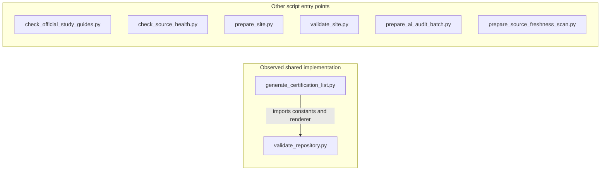

# Component / Import Diagram

## Scope and provenance

- Target: certification-study-library; source revision `858bdfc664f1b8e94ce03ab041acf3fbba7c4f07`.
- Assessed 2026-09-06; September 5 filename retained from the approved plan.
- Mode/profile: Snapshot / standard; reference-only accelerator revision `82d4bca`.
- Method: manual static inspection of import statements in all eight tracked Python scripts, local architecture and workflow definitions. No source code was executed.
- Status: partial static fallback. Literal local imports are covered; dynamic imports, external runtime services and deployed topology are not proven.
- Finding evidence was validated before this view: [component change-risk findings](../findings/2026-09-05-component-change-risk-map.json) and [release assembly](../findings/2026-09-05-release-readiness-assembly.json). No additional finding or finding identity is introduced.

## Observed Python import relationship

An arrow means the importing script depends on the module it points to. The independent entry points in the second group have no literal imports of another repository script.

Evidence: `scripts/generate_certification_list.py:9` imports `CERTIFICATION_LIST_PATH`, `ROOT` and `render_certification_list` from the validator. Standard-library imports are omitted. No literal cross-script cycle was observed in this eight-script scope. One observed edge does not imply low coupling: most coupling is through shared files.

## File and workflow relationships

| Entry point | Principal reads | Principal output / role |
|---|---|---|
| Objective monitor | Vendor/exam records and public responses | Objective/status snapshots and comparison report; writes gated by CLI option and later review |
| Source-health monitor | Approved sources and retained health | Reachability/metadata report and optional reviewed baseline |
| Validator | Catalogs, guides, schemas and snapshots | Errors and process status; gate shared by workflows |
| Certification-list generator | Seed catalog; validator rendering implementation | CERTIFICATIONS.txt |
| Site preparation | Canonical guides/catalogs, public-document allowlist and website templates | Disposable .site-build tree and manifest |
| Site validator | Built static site | Link, anchor, heading and skip-link checks |
| Audit preparer | Guides, blueprints, sources and review/audit ledgers | Bounded audit handoff |
| Freshness preparer | Guides, official source baseline and freshness ledger | Bounded recurring freshness handoff |

The workflows invoke scripts and build tools as separate processes. Those execution edges differ from Python import edges. Provider responses are external inputs, not internal modules.

## Generator write-set review

The cataloged `Invoke-RepoDiscovery.ps1` defaults to structure and Mermaid collection. It writes `repository-inventory.json`, `repository-structure.md`, `component-diagram.json` and `component-diagram.md` under its OutputDir; a Draw.io companion is possible when enabled by policy. Its Mermaid branch enumerates top-level directories. Even selecting only Mermaid writes both model JSON and Markdown, without an exact dated-file output switch.

This does not match the approved one-file import-view destination. The generator was inspected but not invoked. This manually traced view is explicitly a fallback and is not labeled an automated import-scanner result.

## Implications and limitations

The certification-list generator shares validator implementation, while the other scripts share catalog/schema contracts indirectly. Changes to stable IDs, snapshot hashes, review semantics or allowlists can therefore affect multiple entry points without adding Python imports. Review the canonical concentration, integrity and audit-binding findings before modifying those contracts.

Public source metadata and selected local code were processed by the active Codex session. No external evidence provider, scanner, dependency install or second target was used. The user authorized commits/pushes to the existing origin. Artifacts remain in the approved ADLC_Docs/Git record; retention period, expiry action and assistant service governance details are unspecified, owned by the repository owner.

No diagram renderer or runtime call-graph test was executed. Re-run the view when literal/dynamic imports, script boundaries or data consumers change. Findings and future implementation remain subject to user review.

