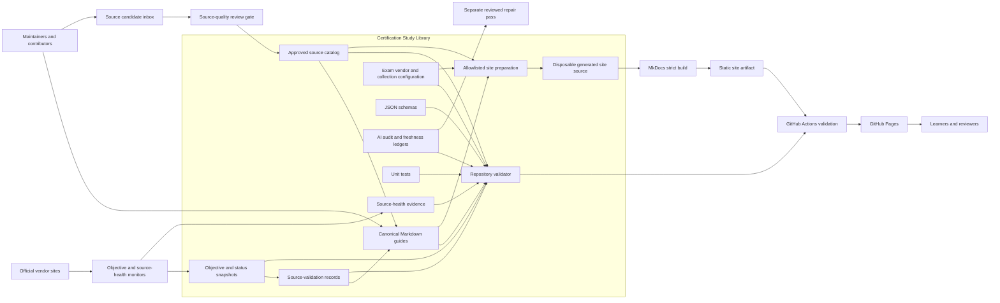

# Dependency Map — Certification Study Library

> **Last updated:** 2026-09-05 · **Discovery version:** 1 (initial brownfield baseline)

## Component diagram

The diagram represents local architecture intent. It does not assert that GitHub workflows, Pages, issues, or pull-request automation are enabled or currently successful.

## Upstream dependencies

| Upstream | Interface | Purpose | Evidence and uncertainty |
|---|---|---|---|
| Official certification catalogs and blueprints | Public HTTPS, manually reviewed snapshots | Exam identity, scope, status, and lifecycle | Registered locally; live state not queried in discovery |
| Official product documentation | Public HTTPS and Markdown links | Technical claims and labs | Registered sources are local; current reachability is represented only by stored health evidence |
| Maintainers/contributors | Git changes, issue forms, pull requests | Content, source, schema, and automation changes | Contribution contract is local; actual remote flow unavailable |
| Python package source | pip package resolution | MkDocs and JSON-schema build dependencies | Direct versions are pinned; transitive resolution and registry state unavailable |

## Downstream dependencies

| Downstream | Interface | Purpose | Evidence and uncertainty |
|---|---|---|---|
| Repository validator | Local Python calls and files | Reject invalid catalogs, guide metadata, references, and assurance states | Existing validation passed; duplicate source-health IDs are a known gap |
| Site preparation/build | Local files → disposable generated tree → static artifact | Publish an allowlisted reader experience | Definition and existing validation evidence available; strict build not rerun for discovery |
| GitHub Actions | Checked-in workflow definitions | Validation, scheduled monitoring, issues/PRs, and Pages publication | Remote execution state unavailable |
| GitHub Pages | Static artifact | Public site hosting | Deployment intent documented; current deployment unverified |
| Work mirror | Repository sync plus private overlay | Internal transformed library | Documentation only; out of scope and not accessed |
| Learners and reviewers | Browser/static content | Study and feedback | No analytics, identity, or usage evidence collected |

## Internal data flows

| Flow | From | To | Pattern | Sensitivity / control |
|---|---|---|---|---|
| Certification discovery | Official catalogs | `config/certification-seeds.json` | Reviewed snapshot | Intended public metadata; no automatic publication |
| Objective baseline | Official blueprint | `data/objective-snapshots/` | Retrieve, normalize, review, commit | Public source; change invalidates review state |
| Source promotion | `data/source-candidates.json` | `data/sources.json` | Explicit human/agent review gate | Public-source and licensing policy applies |
| Guide publication | Guides/config/catalogs | `.site-build/docs` | Allowlisted generated copy | Prevents unrelated working files from entering the site |
| Static build | `.site-build` | `site/` artifact | MkDocs strict build | Disposable generated output |
| Assurance | Guide + baseline + rubric | AI-audit/freshness ledger | Fresh-context read-only review | Findings require a separate repair decision |
| Maintenance | Monitor output | Issue or pull request | Review proposal | Workflow permission and remote state unknown |

## Coupling and blast-radius observations

- `scripts/validate_repository.py` couples most catalog contracts and aggregate checks into one central gate; changes can affect the entire 222-guide corpus.
- `scripts/check_official_study_guides.py` contains provider-specific parsing plus routing for 26 adapter keys; provider additions share one module-level blast radius.
- Stable identifiers join guides, exams, vendors, sources, health records, reviews, snapshots, candidates, and audit/freshness ledgers. Identifier changes require coordinated migration.
- The static-site allowlist is a security boundary. Expanding it can expose files that were never intended for publication.
- Validation and Pages workflows repeat the same verification sequence, so maintenance changes must currently remain synchronized.

## Unknown relationships

- Remote GitHub branch/review/ruleset relationships.
- Actual workflow-to-issue/PR permissions and historical use.
- Pages environment protection and deployed revision.
- Search indexing, analytics, uptime, and user traffic.
- Whether any external automation not represented in the repository also consumes or modifies the catalogs.

