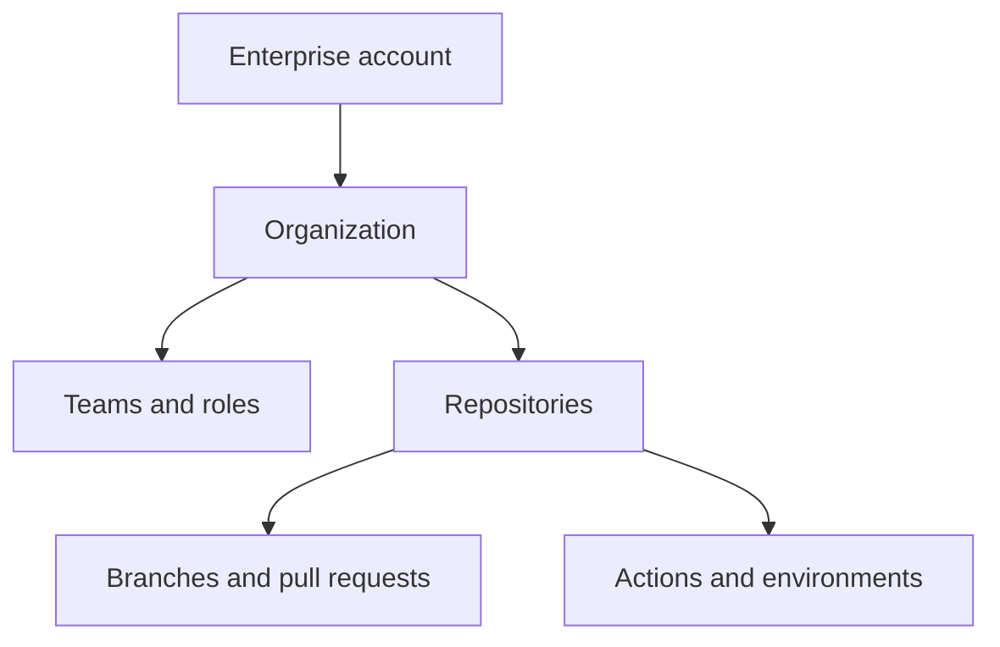
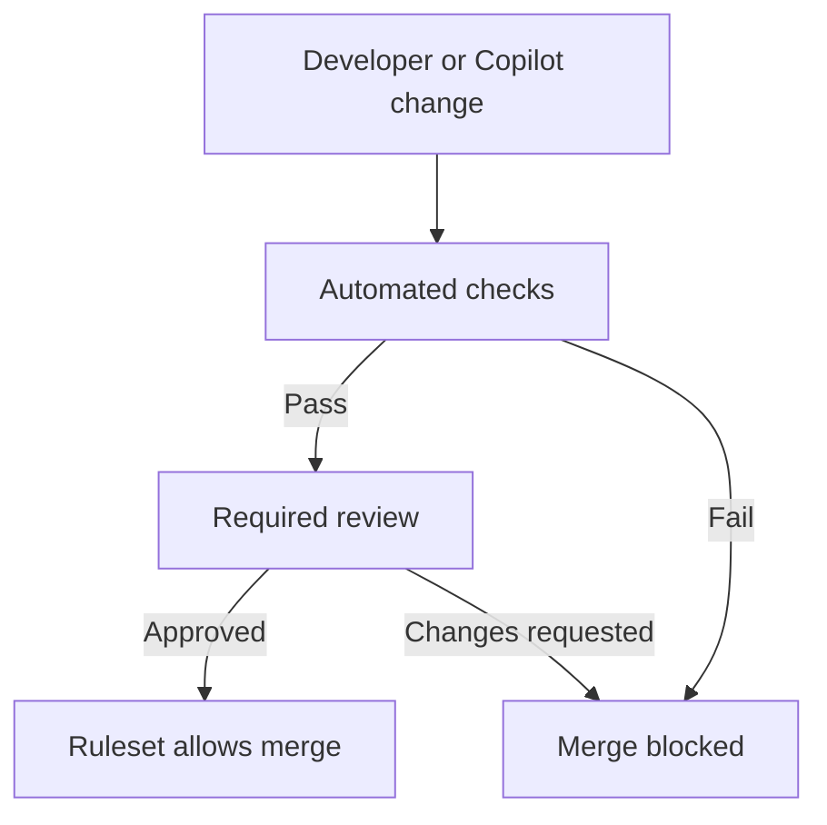

# GH-300 GitHub Copilot Study Guide

> **Independent AI-assisted resource — SOURCES + OBJECTIVES CHECKED; HUMAN REVIEW PENDING.** Objective coverage, citations, volatility labels, links, and exam-integrity compliance were checked on September 5, 2026; this is not a guarantee that the guide is error-free or current after that date. See the [sources-and-objectives record](../docs/SOURCE-VALIDATION.md#gh-300-coverage-record). The [official GH-300 blueprint](https://learn.microsoft.com/en-us/credentials/certifications/resources/study-guides/gh-300) is authoritative.

## Responsible use, features, data architecture, context, productivity, safeguards, and governance

**Prepared:** September 5, 2026<br>
**Exam:** GH-300 GitHub Copilot<br>
**Current baseline:** Skills measured as of August 7, 2026<br>
**Upcoming blueprint change:** None announced on the official study guide as of September 5, 2026.

> **VERIFY CURRENT:** Copilot changes rapidly. Recheck pricing, plans, models, feature availability, previews, UI paths, commands, quotas, credits, data handling, and retention in the linked official documentation. Those details are synchronized only to the `last_verified` date above and can change without an exam-blueprint revision.

This standalone guide maps the August 7, 2026 blueprint and includes public-source corrections and additions for Timothy Warner's June 2026 repository.

The current official blueprint is the final authority:

- [Microsoft GH-300 study guide](https://learn.microsoft.com/en-us/credentials/certifications/resources/study-guides/gh-300)
- [GitHub Copilot documentation](https://docs.github.com/en/copilot)

## How to use this guide

Begin with Part 0 to understand the complete exam map. Read Parts 1 and 2 slowly because they explain GitHub's operating model and how standards become enforceable. Parts 3 through 6 focus on current Copilot capabilities. Complete the labs rather than merely reading their steps. Finish with the exam distinctions and readiness checklist.

> **About related items:** A `Related item:` callout adds prerequisite, operational, architectural, or adjacent context that makes the current topic easier to understand. It is useful supporting knowledge, not a claim that the item appears verbatim in the published exam objectives.

The most important mental model is:

> Copilot instructions help produce a compliant change. GitHub Actions test the change. Ownership routes it to the right reviewers. Rulesets prevent the change from merging until the required evidence and approvals exist.

---

## Part 0: Complete blueprint coverage

### Current objective map

| Domain | Weight | Main coverage |
|---|---:|---|
| Use GitHub Copilot responsibly | 15–20% | This part; Parts 4 and 5 |
| Use GitHub Copilot features | 25–30% | Parts 3, 4, and 6 |
| Understand Copilot data and architecture | 10–15% | This part and Part 5 |
| Apply prompt engineering and context crafting | 10–15% | This part and Parts 3–4 |
| Improve developer productivity | 10–15% | This part and labs |
| Configure privacy, exclusions, and safeguards | 10–15% | Parts 5 and 6 |

The official page currently contains a duplicated “GitHub Copilot features” line in its high-level list. Treat the detailed objective groups and their published ranges as authoritative; do not invent a separate eighth domain.

### Responsible AI

Microsoft’s six current Responsible AI principles are:

1. **Fairness:** Examine generated logic and data for unequal treatment or biased assumptions.
2. **Reliability and safety:** Test output, handle failures, and constrain consequential actions.
3. **Privacy and security:** Protect secrets, personal information, proprietary material, and system access.
4. **Inclusiveness:** Consider accessibility and users with different abilities and circumstances.
5. **Transparency:** Make AI involvement and important limitations understandable.
6. **Accountability:** A human or organization remains answerable for accepted decisions and code.

These principles are defined in Microsoft's current [Responsible AI overview](https://learn.microsoft.com/en-us/azure/machine-learning/concept-responsible-ai). The exam application is practical: identify a risk, choose a mitigation, define validation evidence, and keep a human accountable for the outcome.

#### Risks and limitations

Copilot can produce:

- Plausible but incorrect code or explanations
- Insecure defaults and incomplete validation
- Outdated APIs or nonexistent functions
- Biased assumptions in logic, examples, or test data
- Code that resembles public code
- Tests that validate the generated implementation instead of the real requirement
- Excessive permissions or destructive commands
- Confident explanations that hide uncertainty

Mitigate these risks with precise scope, authoritative documentation, tests, static analysis, dependency review, security scanning, least privilege, human review, and production change controls.

> Copilot confidence is not evidence. A passing validation command, inspected diff, security result, or authoritative reference is evidence.

#### Responsible operation

- Never submit unapproved sensitive information merely to obtain a better answer.
- Validate generated code in an isolated, appropriate environment.
- Review packages, licenses, network calls, permissions, and data flows.
- Preserve human approval for production deployment and destructive change.
- Report harmful or incorrect output through appropriate feedback channels.
- Keep responsibility with the person or team accepting the work.

> **Related item:** Treat consequential Copilot use as a lightweight model-risk workflow: define the allowed task, data boundary, validation evidence, human decision owner, and rollback. This operationalizes responsible-AI principles without pretending every suggestion needs the same level of governance.

### Data handling and architecture

At an exam level, understand this request lifecycle:

1. The user provides an explicit prompt or triggers a suggestion.
2. The client gathers applicable context, such as cursor location, surrounding code, open files, instructions, chat history, or explicit references.
3. Copilot constructs and transmits the request through its service.
4. Input processing and proxy filtering apply.
5. The selected model generates candidate output.
6. Post-processing and filters apply, including safety and public-code mechanisms where configured.
7. The client presents a suggestion, response, diff, or proposed tool action.
8. The developer accepts, rejects, edits, or validates the result.

GitHub's [responsible-use description of inline suggestions](https://docs.github.com/en/copilot/responsible-use/inline-suggestions) documents the input-processing, model-generation, response, and filtering lifecycle for that surface. Other Copilot surfaces can add tools, retrieval, or agent orchestration, so do not assume every feature has an identical pipeline.

Do not describe “statistical analysis and pattern recognition” as a separate Copilot product-processing stage. It is a broad description of model behavior, not one of the named service stages the exam-oriented material emphasizes.

#### Prompt and context data

Context can include code, selections, filenames, repository instructions, prompt files, chat history, tool output, and retrieved resources. What is sent or retained depends on the feature, plan, client, policy, model host, and current terms.

**VERIFY CURRENT:** Review GitHub's current data-handling, model-hosting, retention, and BYOK documentation before making a customer claim. Do not generalize a zero-retention statement from one model/provider/GA feature to every preview feature or integration.

#### Limitations of finite context

An LLM cannot attend equally to unlimited information. Large irrelevant attachments can dilute important requirements. A client may select context automatically, use semantic retrieval, or compact conversation history. Compaction can preserve a summary while losing exact detail.

Keep durable decisions in repository artifacts such as issues, ADRs, instructions, tests, and code—not only in chat history.

> **Related item:** Retrieval-augmented generation (RAG) and semantic retrieval can select relevant external context without retraining the model. Retrieval improves grounding, but stale, unauthorized, poisoned, or irrelevant sources can still produce a well-written wrong answer.

### Prompt engineering and context crafting

A strong prompt normally contains:

| Element | Question answered |
|---|---|
| Goal | What outcome is required? |
| Context | What code, system, or problem matters? |
| Constraints | What must or must not change? |
| Examples | What pattern should the response follow? |
| Validation | How will success be demonstrated? |
| Output format | Plan, patch, explanation, table, test, or command? |

This structure operationalizes GitHub's current [prompt-engineering guidance](https://docs.github.com/en/copilot/concepts/prompting/prompt-engineering): start with the goal, provide relevant context and examples, split complex work, avoid ambiguity, iterate, and keep history relevant.

Example:

> Review `modules/key-vault` for public exposure and excessive RBAC. Do not modify files. Compare the module with the repository instructions, cite file paths and line-level evidence, classify each finding by severity, and finish with the exact Terraform validation and security commands you recommend.

#### Zero-shot and few-shot prompting

- **Zero-shot:** Request the task without a worked example. It is efficient when the instruction and expected pattern are clear.
- **Few-shot:** Include one or more examples to demonstrate structure, naming, classification, or style. It helps when the desired pattern is difficult to describe precisely.

Examples consume context and can accidentally teach defects. Use the smallest representative set and explicitly state which features of the example matter.

#### Iterative prompt flow

For a substantial change:

1. Ask Copilot to explain the current system.
2. Request a plan without edits.
3. Correct assumptions and narrow scope.
4. Request implementation.
5. Inspect the diff and tool activity.
6. Run deterministic validation.
7. Ask for a review against the original requirements.
8. Perform final human review.

Specific, relevant context is more valuable than verbosity. “Surround” in older course terminology means providing useful surrounding context; it does not mean attaching everything.

> **Related item:** Context engineering extends prompt writing to the whole information environment: instructions, selected files, tool results, examples, memory, and output contracts. The security boundary must cover every context source, not just the words typed by the user.

### Improving developer productivity

Copilot can assist with:

- Code generation and boilerplate
- Refactoring and code explanation
- Documentation and comments
- Sample or synthetic data
- Legacy-code modernization
- Unit and integration tests
- Edge-case discovery and assertions
- Security and performance suggestions
- Learning unfamiliar languages, frameworks, or repositories

GitHub's [Copilot best-practices guide](https://docs.github.com/en/copilot/get-started/best-practices) describes both these productivity uses and the obligation to check Copilot's work. The productivity gain comes from reducing mechanical work and context switching—not from eliminating review.

#### Refactoring and modernization

Preserve behavior with characterization tests before a risky refactor. Ask Copilot to identify public interfaces, side effects, data formats, and compatibility constraints. Modernization should be incremental and measurable; generated “cleaner” code can still change behavior.

Use GitHub's [refactoring walkthrough](https://docs.github.com/en/copilot/tutorials/refactor-code) as a practice pattern, not a guarantee that a generated refactor preserves behavior.

#### Tests and assertions

Keep these distinct:

- A **precondition/input assertion** checks whether data is valid before processing.
- A **test assertion** compares actual behavior with expected behavior.

Generated tests need independent review. A model can reproduce the same misunderstanding in both implementation and test. Include normal cases, boundaries, invalid inputs, permissions, failure paths, and regression cases.

The official [writing tests with Copilot tutorial](https://docs.github.com/en/copilot/tutorials/write-tests) provides unit- and integration-test examples while also distinguishing simple generation from complex cases that need more detailed prompting.

#### Security and performance suggestions

Treat Copilot findings as hypotheses. Confirm security claims with threat modeling, scanners, provider documentation, and review. Confirm performance claims with profiling or measurement. A change that is theoretically faster may reduce clarity or have no effect on the real bottleneck.

---

## Part 1: GitHub foundations

### 1. Git and GitHub are related but different

**Git** is the distributed version-control system on your computer. It stores snapshots of files as commits and tracks the relationships among those commits.

**GitHub** hosts Git repositories and adds collaboration and governance:

- Pull requests
- Reviews and approvals
- Issues and projects
- Teams and permissions
- GitHub Actions
- Rulesets and branch protection
- Security scanning
- Audit logs
- Copilot administration

You can use Git without GitHub. GitHub depends on Git concepts but adds the workflow around them.

### 2. The four local Git areas

When working locally, think in four areas:

| Area | Meaning | Common command |
|---|---|---|
| Working tree | Files currently on disk | `git status` |
| Staging area/index | Changes selected for the next commit | `git add` |
| Local repository | Commits stored locally | `git commit` |
| Remote repository | Shared repository hosted on GitHub | `git push` and `git pull` |

A commit does not automatically reach GitHub. `git commit` writes locally; `git push` publishes commits to a remote.

### 3. Commits, branches, and remotes

#### Commits

A commit is a snapshot plus metadata:

- Parent commit
- Author and committer
- Timestamp
- Message
- Tree of tracked content

A good commit is understandable, focused, and reversible. Avoid combining unrelated changes.

#### Branches

A branch is a movable reference to a commit. Creating a branch is inexpensive because Git does not copy the entire repository.

Typical commands:

```bash
git switch main
git pull --ff-only
git switch -c feature/add-private-key-vault
```

`git pull --ff-only` prevents Git from silently creating a merge commit during a routine update. Teams may choose a different policy, but you should understand what yours does.

#### Remotes

The conventional remote name is `origin`:

```bash
git remote -v
git push --set-upstream origin feature/add-private-key-vault
```

`--set-upstream` connects the local branch to its remote tracking branch. Future `git push` and `git pull` commands can then omit the branch name.

### 4. Branch versus fork

| Branch | Fork |
|---|---|
| Another line of work inside the same repository | A separate repository derived from the original |
| Normally used by collaborators with write access | Common for external contributors or stronger isolation |
| Shares repository settings and Actions configuration | Has separate settings, permissions, and Actions considerations |
| Pull request usually targets another branch in the same repository | Pull request crosses from the fork into the upstream repository |

For an internal platform team, feature branches are common. For open source or untrusted contributors, forks are common.

### 5. GitHub flow

GitHub flow is a lightweight change lifecycle:

1. Start from an updated default branch.
2. Create a feature branch.
3. Make focused changes.
4. Commit and push.
5. Open a pull request.
6. Run automated checks.
7. Review and revise.
8. Merge after requirements pass.
9. Delete the feature branch.

The official overview is [GitHub flow](https://docs.github.com/en/get-started/using-github/github-flow).

Example:

```bash
git switch main
git pull --ff-only
git switch -c feature/diagnostic-settings

# Edit files
terraform fmt -recursive
git status
git diff

git add modules/monitoring variables.tf
git commit -m "feat: add diagnostic settings support"
git push -u origin feature/diagnostic-settings
```

If GitHub CLI is installed, you can open a pull request with:

```bash
gh pr create --fill
```

Remember that `gh` is GitHub CLI. The standalone `copilot` command is GitHub Copilot CLI. They are separate products.

### 6. Pull requests

A pull request is a proposal to merge one branch into another. It is not merely a request to copy files. It becomes the collaboration and evidence record for a change.

A useful pull request explains:

- Why the change is needed
- What changed
- How it was validated
- Security implications
- Deployment or rollback considerations
- Expected Terraform replacements or downtime
- Related issue or requirement

The pull request aggregates:

- Commits and file diffs
- Review conversations
- Approvals
- Status checks
- Copilot review comments
- Links to issues and deployments

#### Draft pull requests

A draft PR signals that the work is not ready for final review. Automated checks can still run, and early feedback can still be collected.

#### Review outcomes

Reviewers can:

- Comment without approving or blocking
- Approve
- Request changes
- Add suggested changes

Copilot code review provides recommendations and an approval assessment. In the current public preview, administrators can also enable Copilot to submit an approval that counts toward a repository's required-approval rule. The capability is off by default and governed at enterprise, organization, and repository scope. An assessment alone does not count as approval, and accountable people still own the policy and merge risk. See [Copilot code review approvals](https://github.blog/changelog/2026-09-01-copilot-code-review-can-now-approve-pull-requests/).

### 7. Merge strategies

| Strategy | Result | Useful when |
|---|---|---|
| Merge commit | Preserves branch commits and adds a merge commit | Branch history and grouping matter |
| Squash and merge | Combines the PR into one commit | Feature branches contain noisy incremental commits |
| Rebase and merge | Replays commits onto the base branch without a merge commit | A linear history is required and commits are already clean |

No strategy is universally correct. The organization should choose and document a consistent approach.

For infrastructure repositories, squash merging is often convenient because it creates one easily reversible commit per PR. A mature team may preserve multiple commits when they represent meaningful, independently reviewable steps.

### 8. Merge conflicts

A merge conflict occurs when Git cannot safely reconcile competing changes. The developer must choose the correct final content, not merely remove conflict markers.

A safe routine is:

```bash
git fetch origin
git rebase origin/main

# Resolve files, then:
git add <resolved-files>
git rebase --continue
```

To abandon the rebase:

```bash
git rebase --abort
```

After rebasing a branch that was already pushed, updating the remote normally requires a guarded force push:

```bash
git push --force-with-lease
```

`--force-with-lease` is safer than `--force` because it refuses to overwrite remote work you have not observed.

### 9. Repository, organization, and enterprise hierarchy



#### Enterprise account

The enterprise is the top governance boundary. It can establish identity, security, Copilot, Actions, repository, and audit policies across organizations.

#### Organization

An organization is a container for shared repositories, teams, members, policies, billing, and audit data. Organization owners administer it.

#### Team

A team groups people for scalable access and ownership. Teams can be nested and assigned repository roles.

Examples:

- `azure-platform`
- `terraform-maintainers`
- `security-reviewers`
- `application-developers`

#### Repository roles

Common repository roles progress from least to most privilege:

- Read
- Triage
- Write
- Maintain
- Admin

Grant the lowest level needed. Avoid giving repository admin simply because a user needs to merge code.

See [roles in an organization](https://docs.github.com/en/organizations/managing-peoples-access-to-your-organization-with-roles/roles-in-an-organization).

### 10. GitHub Actions and status checks

A GitHub Actions workflow is a YAML file under `.github/workflows/`. An event triggers the workflow; jobs run on runners; steps execute actions or commands.

Example Terraform PR checks:

```yaml
name: Terraform pull request validation

on:
  pull_request:
    paths:
      - "**/*.tf"
      - "**/*.tfvars"

permissions:
  contents: read

jobs:
  terraform-quality:
    runs-on: ubuntu-latest
    steps:
      - uses: actions/checkout@v4

      - uses: hashicorp/setup-terraform@v3
        with:
          terraform_version: 1.14.0

      - run: terraform fmt -check -recursive
      - run: terraform init -backend=false
      - run: terraform validate
```

The workflow checks the change, but it does not automatically block merging. A ruleset or branch-protection rule must require the resulting status check.

#### Reusable workflows

A reusable workflow centralizes validation logic. It uses `workflow_call`:

```yaml
on:
  workflow_call:
```

A consuming repository calls it as a job:

```yaml
jobs:
  validate:
    uses: contoso-cloud/shared-workflows/.github/workflows/terraform-quality.yml@v2
```

Reusable workflows reduce copy-and-paste drift. Pin them to an approved tag or commit according to organizational policy. See [reusing workflows](https://docs.github.com/en/actions/how-tos/reuse-automations/reuse-workflows).

### 11. CODEOWNERS

`CODEOWNERS` maps paths to accountable users or teams:

```text
# Terraform files
*.tf @contoso/terraform-maintainers

# CI/CD workflows
.github/workflows/ @contoso/platform-engineering

# Copilot and agent configuration
.github/copilot-instructions.md @contoso/ai-governance
.github/agents/ @contoso/ai-governance
```

Important distinction:

> CODEOWNERS requests the appropriate reviewers. It does not require their approval unless a ruleset or branch rule requires code-owner review.

### 12. Rulesets and branch protection

Rulesets protect branches and tags. A typical `main` ruleset may require:

- Changes through pull requests
- One or two approvals
- Code-owner approval
- Resolved conversations
- Passing Terraform and security checks
- Signed commits
- Linear history
- No force pushes
- No branch deletion

Required status checks prevent merging until the selected checks pass. See [available rules for rulesets](https://docs.github.com/en/repositories/configuring-branches-and-merges-in-your-repository/managing-rulesets/available-rules-for-rulesets).

Rulesets are preferable to relying on developer memory. They convert an expectation into a platform control.

### 13. Environments and deployment approvals

GitHub environments represent targets such as `dev`, `qa`, and `production`. They can contain:

- Environment secrets and variables
- Required reviewers
- Deployment branch restrictions
- Wait timers
- Protection rules

A production workflow should authenticate to Azure through OIDC where possible instead of storing long-lived client secrets.

---

## Part 2: How organizational standards work

### 14. Standards are a system, not one file

A mature GitHub standard has multiple layers:

| Layer | Question answered | Example |
|---|---|---|
| Policy | What is allowed? | Copilot CLI enabled; unapproved models disabled |
| Guidance | What should people and Copilot do? | Prefer managed identities |
| Template | How should work begin? | Terraform repository template |
| Automation | Did the change satisfy a deterministic check? | `terraform validate` |
| Ownership | Who is accountable for review? | Terraform maintainers |
| Enforcement | Can a noncompliant change merge? | Required ruleset checks |
| Audit | What changed, who changed it, and what was used? | Audit-log events |

Confusing these layers produces weak governance. An instruction is not an enforcement mechanism. A workflow is not mandatory unless a rule requires its result. A code owner is not an approval gate unless a rule requires that approval.

> **Related item:** Policy as code lets an organization version, review, test, and automatically evaluate controls. It complements Copilot instructions: instructions steer generation toward the standard; policy tests provide deterministic evidence about the resulting change.

### 15. Copilot policy

Copilot policies control access to features, agents, and models. They are configured at enterprise and organization scopes.

An enterprise can:

- Enable a feature
- Disable a feature
- Enable it only for selected organizations
- Delegate the decision by setting no enterprise policy

If the enterprise has made an explicit decision, an organization cannot override it. If the enterprise delegates, organizations can differ. This can create different feature availability for users associated with multiple organizations.

Examples of policy-controlled capabilities include:

- Copilot CLI
- Agent mode
- Copilot cloud agent
- Copilot code review
- MCP usage
- Model availability
- Suggestions matching public code

See [GitHub Copilot policies](https://docs.github.com/en/copilot/concepts/policies) and [policy conflicts](https://docs.github.com/en/copilot/reference/enterprise-administrators/policy-conflicts).

### 16. Copilot customization mechanisms

| Mechanism | Purpose | Invocation |
|---|---|---|
| Custom instructions | Persistent guidance | Automatically applied when supported |
| Prompt file | Reusable task request | Explicitly invoked |
| Custom agent | Specialized role with selected behavior and tools | Selected or delegated to |
| Agent skill | Packaged procedure, scripts, and resources | Loaded when relevant |
| MCP server | External tools and data | Agent calls exposed tools |
| Hook | Deterministic interception around agent activity | Triggered by defined events |
| Ruleset | Repository governance and merge enforcement | Evaluated by GitHub |

#### Repository-wide instructions

Location:

```text
.github/copilot-instructions.md
```

Good repository instructions describe durable facts and constraints:

```markdown
# Azure Terraform repository instructions

- Reuse existing modules before adding direct resource blocks.
- Use managed identity instead of client secrets when supported.
- Do not enable public network access unless the requirement explicitly calls for it.
- Use typed variables with descriptions.
- Mark secret variables and outputs as sensitive.
- Run terraform fmt, terraform init -backend=false, and terraform validate.
- Explain resource replacements and expected downtime.
- Generate a plan only. Never apply infrastructure without explicit approval.
```

Avoid vague instructions such as "write good code." Prefer observable rules.

#### Path-specific instructions

Location pattern:

```text
.github/instructions/*.instructions.md
```

Example:

```markdown
---
applyTo: "**/*.tf"
---

- Prefer for_each when resource identity matters.
- Do not use provisioners without explaining why provider-native functionality is insufficient.
- Pin providers according to versions.tf.
- Do not add policy suppressions without a documented exception.
```

Path-specific instructions keep Terraform guidance from interfering with PowerShell, Python, or documentation.

#### Organization instructions

Organization owners can define broad instructions, but support is surface-specific. Current GitHub documentation says organization instructions are supported for:

- Copilot Chat on GitHub.com
- Copilot code review on GitHub.com
- Copilot cloud agent on GitHub.com

Do not assume organization instructions automatically reach every developer's IDE. Repository instructions remain important. See [organization custom instructions](https://docs.github.com/en/copilot/how-tos/copilot-on-github/customize-copilot/add-custom-instructions/add-organization-instructions).

#### Prompt files

Prompt files are reusable tasks, not always-active rules:

```text
.github/prompts/terraform-review.prompt.md
```

Example purpose:

> Review the Terraform diff for replacements, public exposure, excessive permissions, unpinned providers, secret leakage, and missing diagnostic settings. Return findings by severity with file references.

Remember:

> Instructions describe how Copilot should generally behave. Prompt files package something you deliberately ask it to do.

#### Custom agents

A custom agent specializes Copilot for a role such as:

- Terraform reviewer
- Security reviewer
- Test generator
- Documentation maintainer

An agent profile can define its identity, instructions, tools, and MCP servers. Restrict tool access to what the role requires.

#### Agent skills

An agent skill is a folder containing a `SKILL.md` and optionally scripts, references, examples, and templates. Skills package a repeatable capability. Timothy Warner's Cert Buddy demonstrates this well.

Review any skill before preapproving shell access. A skill with shell access can execute commands in the working environment.

#### MCP

Model Context Protocol connects Copilot to tools and data. An MCP server might expose:

- GitHub issues and pull requests
- Microsoft Learn documentation
- Jira or Azure Boards
- Databases
- Cloud APIs
- Browsers

MCP is a security boundary because it may expose actions, not just information. Evaluate:

- Authentication method
- Tool permissions
- Data exposed to the server
- Network destination
- Logging and retention
- Prompt-injection risk
- Whether write actions require approval
- Organization registry and allowlist policies

See [About MCP](https://docs.github.com/en/copilot/concepts/context/mcp) and [MCP management](https://docs.github.com/en/copilot/concepts/mcp-management).

### 17. Turning a Terraform standard into an enforceable control

Suppose the standard is:

> Azure resources must not expose public endpoints unless an approved exception exists.

Implement it across layers:

1. **Policy:** Limit risky agent and MCP capabilities.
2. **Instruction:** Tell Copilot to default to private access.
3. **Template:** Provide modules with secure defaults.
4. **Automation:** Run Checkov, Trivy, or organizational policy tests.
5. **Ownership:** Request security review when networking inputs change.
6. **Enforcement:** Require the security status check and code-owner approval.
7. **Audit:** Record exceptions and monitor policy changes.



This is what "having Copilot follow organizational standards" should mean. Copilot improves the first attempt; deterministic controls and human accountability protect the result.

---

## Part 3: Current GitHub Copilot CLI

### 18. Do not confuse the retired and current products

The old GitHub CLI extension used commands such as:

```bash
gh copilot suggest
gh copilot explain
```

That extension is retired. The replacement is the standalone, agentic GitHub Copilot CLI, launched with:

```bash
copilot
```

See [replacement for the retired extension](https://docs.github.com/en/copilot/how-tos/use-copilot-for-common-tasks/use-copilot-in-the-cli).

### 19. Installation on Windows

Current official options include WinGet and npm.

WinGet:

```powershell
winget install GitHub.Copilot
```

npm, requiring Node.js 22 or later:

```powershell
npm install -g @github/copilot
```

Windows requires PowerShell 6 or later. Verify the current requirements before installation in a controlled corporate environment. See [installing Copilot CLI](https://docs.github.com/en/copilot/how-tos/copilot-cli/set-up-copilot-cli/install-copilot-cli).

### 20. Authentication

For interactive use, launch the CLI and run:

```text
/login
```

For noninteractive environments, supported token environment variables include:

- `COPILOT_GITHUB_TOKEN`
- `GH_TOKEN`
- `GITHUB_TOKEN`

Do not paste tokens into prompts, source files, transcripts, or command history. Copilot CLI can also fall back to an authenticated GitHub CLI token. Classic personal access tokens are not supported for Copilot CLI; consult the current authentication documentation for supported token types and permissions.

### 21. Trust and permissions

When Copilot CLI starts, it asks whether you trust the working directory. Trust means the agent may read, modify, and execute content beneath that location according to its permissions.

Configure deliberately:

- Trusted directories
- Allowed tools
- File-path permissions
- URL permissions
- MCP servers
- Sandbox behavior

Do not launch an agent from a broad or sensitive directory. Open the specific repository instead.

The following flags remove important confirmation boundaries:

```text
--allow-all
--yolo
```

Use them only in a disposable, well-isolated environment whose contents and network access you understand.

Local sandboxing can restrict commands and tools:

```text
/sandbox enable
```

See [configuring Copilot CLI](https://docs.github.com/en/copilot/how-tos/copilot-cli/set-up-copilot-cli/configure-copilot-cli).

### 22. Essential CLI commands

Commands change quickly, so `/help` is authoritative for the installed version.

| Command | Purpose |
|---|---|
| `/help` | Show available commands |
| `/login` | Authenticate |
| `/model` | Inspect or change model selection |
| `/plan` | Develop an implementation plan before changing code |
| `/review` | Run code review against changes |
| `/pr` | Work with the pull-request lifecycle |
| `/session` | Display session information |
| `/rename NAME` | Give the current session a useful name |
| `/resume` | Choose and resume a previous session |
| `/ide` | Connect to or manage a VS Code workspace |
| `/context` | Inspect context-window use |
| `/compact` | Compress conversation history |
| `/usage` | Review session duration, edits, tokens, models, and credits |
| `/chronicle` | Search and analyze session history |
| `/mcp` | Inspect or manage MCP connections |
| `/skills` | Inspect available skills |

From the shell:

```bash
copilot --continue
copilot --resume
copilot --resume SESSION-ID
```

Session data can be synced to a GitHub account by default. Understand the organization's retention and data-handling requirements before using it with customer code.

### 23. Plan Mode

Plan Mode asks Copilot to analyze and propose a structured plan before implementation. It creates a review gate, but it is not an authorization system by itself.

A strong Terraform planning prompt is:

```text
Plan the addition of diagnostic settings for the existing Azure resources.
Do not edit files yet. Identify affected modules, required destinations,
provider-version constraints, replacement risk, permissions, tests, and
questions that must be answered before implementation.
```

Review whether the plan:

- Uses existing modules
- Respects repository boundaries
- Identifies unknown requirements
- Separates implementation from deployment
- Includes validation
- Recognizes security and replacement risk

### 24. Sessions and context management

A session preserves the conversation, actions, plans, and tracked files for a task. Sessions allow work to pause and resume.

Useful habits:

- Rename important sessions.
- Use one clear objective per session.
- Check `/context` during long work.
- Use `/compact` before irrelevant history displaces critical constraints.
- Start a new session when the objective materially changes.
- Review session data before sharing it.

`/chronicle` can generate standups, search prior work, suggest instruction improvements, and provide cost advice. See [using Copilot CLI session data](https://docs.github.com/en/copilot/how-tos/copilot-cli/use-copilot-cli/chronicle).

### 25. VS Code integration

Copilot CLI can connect to a matching trusted VS Code workspace. It can:

- Receive the active editor selection as context
- Display proposed changes as diffs
- Use current diagnostics
- Show and resume CLI sessions from the Sessions view

Use `/ide` to inspect or change the connection. If you bypass edit approval with `--allow-all` or `--yolo`, the normal VS Code diff approval can be skipped.

### 26. CLI safety checklist

Before a significant task:

- Confirm the repository and branch.
- Run `git status`.
- Confirm no customer secrets or unrelated files are accessible.
- Start in Plan Mode.
- Inspect enabled MCP servers and tools.
- Keep command and file approval enabled.
- Define allowed files and forbidden actions in the prompt.
- Require tests and diff review.
- Do not permit `terraform apply` unless explicitly authorized.

After the task:

- Review `git diff`.
- Run deterministic checks yourself.
- Inspect new dependencies and workflow permissions.
- Review the session for sensitive content.
- Commit only the intended files.

---

## Part 4: Agent modes, sessions, sub-agents, and MCP

### 27. Current feature distinctions

| Feature | Where it operates | Typical output | Human control point |
|---|---|---|---|
| Inline suggestion | IDE editor | Suggested code at cursor | Accept or reject |
| Chat/Ask | IDE or GitHub.com | Explanation or recommendation | Evaluate response |
| Copilot Edits | IDE | Scoped edits | Review diffs |
| Agent Mode | Local IDE | Multi-file edits and terminal actions | Tool approval and diff review |
| Copilot CLI | Local terminal or supported remote environment | Plans, edits, commands, reviews | Permissions and session review |
| Copilot cloud agent | GitHub Actions-powered environment | Research, plan, branch changes, optional PR | Session, diff, and PR review |
| Custom agent | Multiple supported Copilot surfaces | Specialized behavior and tools | Agent selection and tool scope |
| Sub-agent | Separate bounded context delegated by a parent | Specialist result returned to parent | Parent integration and validation |

Current exam wording uses **Copilot Edits**, even when older material says Edit Mode.

### 28. Agent Mode versus cloud agent

#### Agent Mode

- Runs through the local IDE experience.
- Reads and edits local workspace files.
- Can propose terminal commands.
- Iterates after tests or commands fail.
- Keeps the developer in an interactive loop.

#### Copilot cloud agent

- Runs in a GitHub Actions-powered environment.
- Can be delegated work through issues or Copilot prompts.
- Can research, plan, change a branch, and optionally open a pull request.
- Operates asynchronously.
- Requires repository and organization configuration.

Do not memorize the older rule that every cloud-agent session automatically creates a pull request. Current cloud workflows can research and plan without immediately opening one.

See [Copilot cloud agent](https://docs.github.com/en/copilot/concepts/agents/cloud-agent/about-cloud-agent).

### 29. Custom agents versus sub-agents

A **custom agent** is a reusable specialist definition. It packages role-specific instructions and selected tools.

A **sub-agent** is a temporary delegated worker with a separate context. In Copilot CLI, invoking a custom agent performs the work through a sub-agent. Separate context prevents detailed specialist work from crowding the parent agent's main context.

Example:

```text
Parent agent: Coordinates an Azure Terraform change.
Security sub-agent: Reviews network exposure and identities.
Testing sub-agent: Designs validation and policy tests.
Documentation sub-agent: Updates module usage documentation.
Parent agent: Reconciles the results and presents one coherent change.
```

Delegation does not eliminate validation. The parent can misunderstand or combine results incorrectly.

### 30. Agent skills

Skills are reusable capability packages. A good skill contains:

- A clear trigger and scope
- Required inputs
- Ordered procedure
- Deterministic scripts where appropriate
- Reference material
- Output contract
- Validation criteria
- Safety constraints

For example, an `azure-terraform-review` skill might:

1. Inspect changed `.tf` files.
2. Run formatting and validation.
3. Check identity and public-network settings.
4. Identify replacements.
5. Review provider compatibility.
6. Produce findings by severity.

The skill improves repeatability. A ruleset remains necessary if the organization must block unreviewed changes.

### 31. MCP threat model

An MCP server may read data, write data, execute an action, or all three. Before enabling one, ask:

1. Who operates the server?
2. How is it authenticated?
3. Which tools are exposed?
4. What scopes do its credentials possess?
5. Can untrusted repository content influence tool calls?
6. Is approval required before writes?
7. Where are prompts, inputs, and outputs logged?
8. Can the organization restrict it through a registry or allowlist?

Prefer read-only tools during research and planning. Separate write capability into a narrowly scoped tool with explicit approval.

> **Related item:** Indirect prompt injection occurs when untrusted retrieved content tries to redirect the agent or its tools. Treat repository text, issues, webpages, and MCP results as data with a trust level; tool authorization and human approval must not depend on the retrieved content behaving honestly.

### 32. Copilot Spaces, Spark, and pull-request summaries

#### Spaces

Copilot Spaces collect reusable context such as:

- Repositories and code
- Issues and pull requests
- Notes and transcripts
- Images and uploaded files

Spaces ground conversations and can be shared. They provide context; they do not enforce engineering standards.

#### Spark

The blueprint still names GitHub Spark, so understand its historical purpose: creating and deploying full-stack applications from natural-language requests. The Spark workbench on `github.com` stopped accepting new users and app creation on August 4, 2026, and retired on August 31, 2026. Existing deployed apps may continue, but Spark's `llm()` calls stopped when GitHub Models retired. Treat Spark as blueprint vocabulary and lifecycle context, not as an available hands-on path. See the [official Spark retirement notice](https://github.blog/changelog/2026-08-04-upcoming-deprecation-of-github-spark-on-github-com/).

#### Pull-request summaries

Copilot can generate an overview and key-change list from a PR diff. A summary accelerates orientation but does not prove correctness, security, or test coverage.

---

## Part 5: Privacy, exclusions, public code, and safeguards

### 33. Keep the controls separate

| Control | Purpose |
|---|---|
| Content filtering | Detect harmful, offensive, or insecure prompts or responses |
| Suggestions matching public code | Detect or block certain outputs matching public code |
| Content exclusion | Prevent selected content from informing supported Copilot features |
| Custom instructions | Guide Copilot behavior |
| Tool permissions | Limit what an agent can read, write, or execute |
| Rulesets | Prevent noncompliant Git changes from merging |

These controls are not interchangeable.

### 34. Content exclusion

Supported content exclusions are configured through GitHub repository, organization, or enterprise Copilot settings. They use path patterns to identify excluded content.

Current documented effects include preventing affected content from informing supported inline suggestions, Chat responses, and Copilot code review.

#### Critical limitation

Current GitHub documentation states that content exclusion is not supported in:

- Edit and Agent modes in supported IDE Chat experiences

Copilot CLI and the GitHub Copilot app now honor enterprise, organization, and repository content-exclusion policies for Copilot Business and Enterprise customers. See the [September 2026 availability announcement](https://github.blog/changelog/2026-09-02-content-exclusions-generally-available-in-copilot-app-and-cli/).

Therefore:

> Content exclusion must not be treated as a universal secret-protection boundary.

Do not keep secrets in a repository and assume exclusion makes them safe. Use secret stores, remove unnecessary sensitive files from the workspace, and control agent access.

> **Related item:** Data-loss prevention, repository classification, endpoint controls, and secret management operate outside Copilot's content-exclusion feature. Defense in depth is important because local agents, terminals, extensions, and external tools can have different file-access paths.

#### `.copilotignore`

The Timothy Warner repository contains `.copilotignore` guidance. Current official GitHub content-exclusion documentation does not define that file as the supported administrative mechanism. Do not memorize it as an enforceable GitHub control.

See [excluding content from Copilot](https://docs.github.com/en/copilot/how-tos/configure-content-exclusion/exclude-content-from-copilot).

### 35. Suggestions matching public code

The current exam wording is **suggestions matching public code filtering**. Older material may say duplication detection or public-code filter.

Understand the intent:

- Detect certain suggestions that match public code.
- Block or allow them according to policy.
- When allowed, references may provide repository and licensing context.
- A match does not automatically determine whether use is legally appropriate.

> **Related item:** Software-composition and license review can help track third-party code after it enters a repository. Public-code matching is a generation-time signal; dependency inventories, provenance, notices, and legal review address different lifecycle questions.

Important agent limitation: GitHub's responsible-use documentation warns that Copilot CLI and cloud agents can produce matches or near matches even when the standard policy is set to block. Agent results require human review and may surface match details differently.

### 36. Ownership and output limitations

Copilot output can be:

- Incorrect
- Insecure
- Incomplete
- Outdated
- Similar to public code
- Incompatible with the repository license or policy
- Based on misunderstood context

The developer remains responsible for validation. For enterprise work, also follow customer, employer, regulatory, and contractual rules.

### 37. Data and audit boundaries

Do not equate an enterprise audit log with complete prompt surveillance.

GitHub's Copilot audit documentation says audit logs can include:

- Plan, setting, and policy changes
- License assignment changes
- Agent activity on GitHub.com

It does not include every prompt sent during a local client session. A company that needs local agent telemetry may require a separate approved logging solution.

> **Related item:** Observability and privacy can conflict. Collect only the telemetry needed for security, reliability, adoption, and investigation; define access, retention, redaction, and employee notice instead of assuming more prompt logging is always better.

---

## Part 6: Copilot administration, audit, and REST APIs

### 38. Administration mental model

Copilot administration has four related but different data sets:

| Data | Question answered |
|---|---|
| Policy | What features and models are permitted? |
| Seat assignment | Who is licensed? |
| Usage metrics | Which features are being adopted? |
| Audit log | Who changed a control or performed a recorded action? |

Do not use usage metrics as if they were an audit log. Do not use seat assignment as proof of productive usage.

### 39. Policy inheritance and feature availability

An enterprise decision can constrain organizations. Organization owners manage delegated choices. Repository settings may further restrict repository-specific availability for capabilities such as cloud agents.

Scenario:

> The enterprise disables Copilot CLI. An organization owner wants to enable it.

Result: the organization cannot override the enterprise decision.

Scenario:

> The enterprise sets no policy for Copilot code review. Organization A enables it and Organization B disables it.

Result: availability can vary based on which organization grants the user's Copilot license and how policy conflicts are resolved.

### 40. Copilot code review policy and standards

Enabling the code-review policy makes the feature available. Repository instructions influence review behavior. Neither replaces branch-review requirements.

A mature design separates:

1. **Feature policy:** Users may request Copilot code review.
2. **Review instructions:** Copilot should focus on selected standards.
3. **Workflow checks:** Deterministic tests run.
4. **Ruleset:** Required checks and approvals must pass; policy decides whether the current preview permits Copilot-submitted approvals, while production and destructive changes retain accountable human authorization.

Example review instructions:

```markdown
When reviewing Terraform:

- Flag public network access unless an exception is linked.
- Flag credentials, subscription IDs, and tenant IDs embedded in code.
- Identify resource replacements and destructive changes.
- Require typed variables and descriptions.
- Flag provider changes not explained in the pull request.
- Do not recommend suppressing a scanner finding without justification.
```

### 41. Seat-management REST API

The Copilot user-management API supports operations such as:

- Get organization Copilot seat information and settings
- List seat assignments
- Add or remove teams
- Add or remove users
- Get assignment details for a user

Representative endpoint pattern:

```text
GET /orgs/{org}/copilot/billing/seats
```

Team assignment pattern:

```text
POST /orgs/{org}/copilot/billing/selected_teams
```

These operations require appropriate organization permissions. Read operations normally require Copilot Business or organization administration read permission; write operations require the corresponding write permission. Some endpoints remain in preview.

Use the live [Copilot user-management REST reference](https://docs.github.com/en/rest/copilot/copilot-user-management) rather than memorizing preview status or API-version headers.

Exam-level reasoning:

- UI assignment is suitable for occasional manual administration.
- REST administration supports repeatable, large-scale seat lifecycle management.
- Team-based assignment is more scalable than maintaining individual lists.
- Removal can interact with billing cycles and alternate team-based access.

### 42. Audit logs

Useful filters include:

```text
action:copilot
actor:Copilot
action:copilot.cfb_seat_assignment_created
```

`action:copilot` finds Copilot-related plan and administration events. `actor:Copilot` focuses on recorded agent activity.

GitHub documents 180-day enterprise audit-log retention and recommends streaming to a SIEM for longer retention and alerting. See [reviewing Copilot audit logs](https://docs.github.com/en/copilot/how-tos/administer-copilot/manage-for-enterprise/review-audit-logs).

Know what audit logs do not guarantee:

- They do not contain all local prompts.
- They are not the same as usage metrics.
- A seat event does not prove code quality.
- Long-term compliance retention may require streaming.

### 43. Usage and activity

Organization owners can review assigned seats, recent activity, and reports. `last_activity_at` can take time to update and depends on telemetry. Activity data is useful for adoption and seat reclamation but should be interpreted carefully.

A sound adoption review considers:

- Assigned versus active seats
- Feature usage by surface
- Acceptance and review behavior
- Cost and AI-credit use
- Training completion
- Security incidents and policy exceptions
- Developer outcome measures

Avoid treating lines of code generated as a success metric by itself.

> **Related item:** Useful engineering outcomes include lead time, review rework, escaped defects, security findings, developer satisfaction, and time-to-understanding. Pair outcome measures with safeguards so productivity pressure does not reward accepting low-quality generated code.

---

## Part 7: Hands-on labs

### Lab 1: Learn GitHub flow with Terraform

#### Objective

Experience the complete branch-to-merge lifecycle.

#### Steps

1. Create a private practice repository containing a small Terraform module.
2. Protect `main` with a ruleset requiring a pull request.
3. Create `feature/add-diagnostics`.
4. Add a typed variable and a mock diagnostic-setting resource or example.
5. Run `terraform fmt` and `terraform validate`.
6. Commit and push.
7. Open a draft PR.
8. Review the diff and PR metadata.
9. Mark it ready for review.
10. Merge using squash merge.
11. Delete the branch.
12. Inspect the resulting history.

#### Validation questions

- What existed only locally before push?
- Which commit reached `main` after squash merging?
- What evidence remains in the pull request?
- What would have blocked the merge if validation failed?

### Lab 2: Build a standards stack

#### Objective

Implement guidance, checking, ownership, and enforcement as separate controls.

#### Add

```text
.github/copilot-instructions.md
.github/instructions/terraform.instructions.md
.github/CODEOWNERS
.github/workflows/terraform-quality.yml
.github/pull_request_template.md
```

#### Configure

- A rule requiring PRs to `main`
- One approval
- Code-owner review
- The Terraform quality status check
- Resolved conversations

#### Test

1. Ask Copilot to create an insecure storage account.
2. Observe whether instructions improve the proposal.
3. Deliberately violate formatting or a scanner rule.
4. Confirm that Actions finds the problem.
5. Confirm that the ruleset blocks merging.

#### Lesson

Instructions improve behavior; Actions and rulesets enforce outcomes.

### Lab 3: Current Copilot CLI

#### Objective

Practice the standalone agentic CLI safely.

#### Steps

1. Install the current CLI from official documentation.
2. Open only the practice repository.
3. Run `git status`.
4. Launch `copilot`.
5. Authenticate with `/login` if required.
6. Inspect `/help`, `/usage`, and `/context`.
7. Use `/plan` for a Terraform change.
8. Approve only safe read operations.
9. Let the CLI edit one file.
10. Review the diff in VS Code.
11. Run `/review`.
12. Rename the session.
13. Exit and resume it with `copilot --resume`.
14. Inspect session history with `/chronicle`.

#### Safety test

Ask the CLI to explain which directories, tools, URLs, and MCP servers it can access. Verify the configuration rather than trusting the answer alone.

### Lab 4: Content-exclusion boundaries

#### Objective

Learn what exclusions do and do not protect.

#### Steps

1. In a paid practice organization, configure a documented repository content exclusion.
2. Test inline suggestions and supported Chat behavior in the excluded file.
3. Test code review behavior.
4. Review GitHub's documented surface limitations.
5. Do not place real secrets in the test.

#### Explain afterward

- Why is content exclusion different from `.gitignore`?
- Why is it different from an instruction?
- Which agentic surfaces do not honor it?
- What controls must protect actual secrets?

### Lab 5: Agent, skill, and MCP distinctions

#### Objective

Use the Timothy Warner repository as a working example.

#### Steps

1. Inspect `.github/copilot-instructions.md`.
2. Inspect the path-specific instruction file.
3. Inspect one `.prompt.md` file.
4. Inspect the Cert Buddy `.agent.md` profile.
5. Inspect one skill's `SKILL.md`, resources, and validation script.
6. Inspect `.vscode/mcp.json`.
7. Invoke the Cert Buddy to create a CLI lab.
8. Identify which behavior came from instructions, the prompt, the agent, the skill, and MCP.

#### Important correction

Do not use the repository's retired `gh copilot` CLI commands or treat `.copilotignore` as the current supported exclusion control.

---

## Part 8: Exam distinctions to know cold

| Pair | Correct distinction |
|---|---|
| Git versus GitHub | Git is version control; GitHub adds hosting, collaboration, automation, security, and governance |
| Commit versus push | Commit writes locally; push publishes to a remote |
| Branch versus fork | Branch is in the same repository; fork is a separate repository |
| Workflow versus required check | Workflow runs validation; rules make its status mandatory |
| CODEOWNERS versus required approval | CODEOWNERS requests reviewers; rules enforce their approval |
| Instruction versus policy | Instruction guides behavior; policy controls availability |
| Instruction versus prompt file | Instruction is persistent guidance; prompt file is an invoked task |
| Agent versus skill | Agent is a specialized worker; skill is a reusable capability package |
| Skill versus MCP | Skill packages procedure/resources; MCP connects tools and data |
| Agent Mode versus cloud agent | Agent Mode works in the local IDE; cloud agent works asynchronously in a GitHub-hosted environment |
| Custom agent versus sub-agent | Custom agent is a reusable specialist definition; sub-agent is a temporary delegated worker/context |
| Plan Mode versus authorization | Plan Mode creates a planning gate; it does not grant organizational approval |
| Content exclusion versus public-code filtering | Exclusion protects selected input context on supported surfaces; public-code filtering evaluates generated suggestions |
| Content filtering versus content exclusion | Filtering addresses unsafe responses; exclusion controls selected context |
| Audit logs versus metrics | Logs record actions and changes; metrics summarize adoption and usage |
| Seat assignment versus activity | Assignment grants access; activity indicates use |
| Copilot assessment versus approval | An assessment advises and does not satisfy merge requirements; an administrator-enabled preview can let Copilot submit a counting approval, while people remain accountable for policy and merge risk |
| Old `gh copilot` versus current `copilot` | The GitHub CLI extension is retired; the standalone agentic CLI is current |
| Edit Mode versus Copilot Edits | Copilot Edits is the current exam wording |
| Duplication detection versus suggestions matching public code | The latter is the current exam wording |

---

## Part 9: Scenario practice

### Scenario 1

An enterprise owner disables Copilot CLI. An organization owner enables it.

**Answer:** The enterprise decision wins. The organization cannot override an explicit enterprise disablement.

### Scenario 2

A repository includes `.github/copilot-instructions.md` telling Copilot to run `terraform validate`, but the validation never runs.

**Answer:** Instructions are guidance. Add a GitHub Actions workflow to run validation, then require its status through a ruleset.

### Scenario 3

`CODEOWNERS` names the security team, but a PR merges without its approval.

**Answer:** CODEOWNERS alone requests review. Configure a rule requiring code-owner approval.

### Scenario 4

A team excludes `secrets.auto.tfvars` through Copilot settings and then uses Agent Mode, assuming the file cannot be read.

**Answer:** Unsafe assumption. Current documentation says IDE Agent mode does not support content exclusion; support also varies by client and plan. Copilot CLI now honors configured exclusions for Business and Enterprise, but exclusion is still not a secret-management boundary. Remove secrets from the workspace and use proper secret management and access controls.

### Scenario 5

An administrator needs to assign Copilot to 500 users based on team membership.

**Answer:** Use team-based assignment and the Copilot user-management REST API rather than maintaining an individual manual list.

### Scenario 6

A developer wants consistent Terraform security reviews on demand.

**Answer:** Use persistent Terraform instructions for the standards and a reusable prompt file or custom review agent for the review procedure. Back it with deterministic scanners and required checks.

### Scenario 7

A long Copilot CLI session is losing earlier requirements.

**Answer:** Inspect `/context`, use `/compact`, restate critical constraints, or start a focused new session. Store durable requirements in repository instructions rather than relying only on chat history.

### Scenario 8

The company wants to know who changed a Copilot policy and also which users have not used their assigned seats.

**Answer:** Use audit logs for policy changes and activity/seat reports or APIs for adoption and assignment. These are different data sources.

---

## Part 10: Suggested study sequence

### Session 1: GitHub flow and pull requests — 90 minutes

- Read Part 1 through merge strategies.
- Complete Lab 1.
- Explain branch, commit, push, PR, review, and merge without notes.

### Session 2: Governance and enforcement — 90 minutes

- Finish Part 1.
- Read Part 2.
- Complete Lab 2.
- Explain why instructions do not enforce compliance.

### Session 3: Copilot CLI — 90 minutes

- Read Part 3.
- Complete Lab 3.
- Practice sessions, Plan Mode, context inspection, and review.

### Session 4: Agents and MCP — 75 minutes

- Read Part 4.
- Complete Lab 5.
- Explain agents, sub-agents, skills, prompt files, and MCP.

### Session 5: Privacy and administration — 90 minutes

- Read Parts 5 and 6.
- Walk through Lab 4 conceptually or practically.
- Review policy inheritance, audit queries, and REST API purposes.

### Session 6: Exam transfer — 60 minutes

- Review all distinction tables.
- Answer the scenarios without notes.
- Revisit the current Microsoft objective bullets.
- Use Cert Buddy for questions specifically on your weak areas.

---

## Readiness checklist

You are ready when you can explain or demonstrate the following without relying on memorized slogans.

### Responsible use, data, and prompting

- [ ] I can name and apply Microsoft's six Responsible AI principles.
- [ ] I can identify Copilot risks, harms, and appropriate mitigations.
- [ ] I validate output with evidence rather than model confidence.
- [ ] I can describe context gathering, prompt construction, proxy filtering, model generation, and post-processing.
- [ ] I understand that data handling and retention vary by feature, plan, provider, and preview status.
- [ ] I can distinguish zero-shot and few-shot prompting.
- [ ] I can write a prompt with goal, context, constraints, validation, and output format.
- [ ] I can manage finite context and keep durable decisions outside chat history.
- [ ] I can use Copilot for refactoring, documentation, modernization, tests, security, and performance without delegating accountability.

### GitHub fundamentals

- [ ] I can describe working tree, staging area, local repository, and remote.
- [ ] I can create a branch, commit, push, and open a PR.
- [ ] I understand branch versus fork.
- [ ] I can explain merge, squash, and rebase strategies.
- [ ] I understand status checks, reviews, and merge conflicts.
- [ ] I can explain enterprise, organization, team, and repository scopes.

### Standards and governance

- [ ] I can separate policy, instruction, automation, ownership, enforcement, and audit.
- [ ] I understand repository and path-specific instructions.
- [ ] I know organization instructions have surface limitations.
- [ ] I understand CODEOWNERS and required code-owner review.
- [ ] I know a workflow must become a required check to block merging.
- [ ] I can describe reusable workflows and rulesets.

### Copilot CLI

- [ ] I know the old `gh copilot` extension is retired.
- [ ] I can install and authenticate the current `copilot` CLI.
- [ ] I understand trusted directories and permissions.
- [ ] I can plan, review, inspect context, and manage sessions.
- [ ] I understand the risk of `--allow-all` and `--yolo`.
- [ ] I know Copilot CLI honors configured exclusions for Business and Enterprise, while IDE Agent mode remains an explicit limitation and exclusions never replace secret management.

### Agents and customization

- [ ] I can distinguish Copilot Edits, Agent Mode, and cloud agent.
- [ ] I understand sessions and sub-agent context isolation.
- [ ] I can distinguish instructions, prompts, agents, skills, and MCP.
- [ ] I can explain why MCP is a security boundary.
- [ ] I understand Spaces, the retired `github.com` Spark experience, and PR summaries at the exam level.

### Privacy and administration

- [ ] I distinguish content filtering, public-code matching, and exclusion.
- [ ] I do not treat `.copilotignore` as the supported administrative exclusion control.
- [ ] I understand policy inheritance.
- [ ] I know what the Copilot seat API manages.
- [ ] I can use `action:copilot` and `actor:Copilot` conceptually.
- [ ] I distinguish audit data, metrics, and seat assignment.
- [ ] I understand that audit logs do not contain every local prompt.

---

## Corrections and supplements for the June repository

Use Timothy Warner's repository for its excellent agent, skills, prompt, instructions, hooks, and MCP examples. Apply these corrections while studying:

1. Replace **Plan Mode as the fourth IDE trigger** with the current objective wording, **Agent Mode**. Plan Mode remains a useful agent and CLI planning feature.
2. Replace **Edit Mode** with the current exam term **Copilot Edits**.
3. Replace **duplication detection and security warnings** with the current objective wording **suggestions matching public code filtering**.
4. Replace old `gh copilot suggest` and `gh copilot explain` examples with the standalone `copilot` CLI.
5. Do not treat `.copilotignore` as the current supported GitHub content-exclusion control.
6. Recheck models, plans, pricing, AI credits, shortcuts, and feature availability in current documentation rather than memorizing the repository's quick-reference tables.
7. Add separate study for GitHub flow, permissions, Actions, CODEOWNERS, rulesets, environments, audit logs, and REST administration.

---

## Primary references

### Exam

- [GH-300 study guide](https://learn.microsoft.com/en-us/credentials/certifications/resources/study-guides/gh-300)

### GitHub foundations and enforcement

- [About Git](https://docs.github.com/en/get-started/using-git/about-git)
- [GitHub flow](https://docs.github.com/en/get-started/using-github/github-flow)
- [About organizations](https://docs.github.com/en/organizations/collaborating-with-groups-in-organizations/about-organizations)
- [Roles in an organization](https://docs.github.com/en/organizations/managing-peoples-access-to-your-organization-with-roles/roles-in-an-organization)
- [Rules available in rulesets](https://docs.github.com/en/repositories/configuring-branches-and-merges-in-your-repository/managing-rulesets/available-rules-for-rulesets)
- [Reusable workflows](https://docs.github.com/en/actions/how-tos/reuse-automations/reuse-workflows)

### Copilot customization and policy

- [Copilot policies](https://docs.github.com/en/copilot/concepts/policies)
- [Organization custom instructions](https://docs.github.com/en/copilot/how-tos/copilot-on-github/customize-copilot/add-custom-instructions/add-organization-instructions)
- [Repository custom instructions](https://docs.github.com/en/copilot/how-tos/configure-custom-instructions-in-your-ide/add-repository-instructions-in-your-ide)
- [Customization cheat sheet](https://docs.github.com/en/copilot/reference/customization-cheat-sheet)
- [Agent skills](https://docs.github.com/en/copilot/concepts/agents/about-agent-skills)
- [Custom agents](https://docs.github.com/en/copilot/concepts/agents/cloud-agent/about-custom-agents)
- [MCP](https://docs.github.com/en/copilot/concepts/context/mcp)

### Copilot CLI

- [Install Copilot CLI](https://docs.github.com/en/copilot/how-tos/copilot-cli/set-up-copilot-cli/install-copilot-cli)
- [Configure Copilot CLI](https://docs.github.com/en/copilot/how-tos/copilot-cli/set-up-copilot-cli/configure-copilot-cli)
- [Use Copilot CLI](https://docs.github.com/en/copilot/how-tos/copilot-cli/use-copilot-cli/overview)
- [Copilot CLI command reference](https://docs.github.com/en/copilot/reference/copilot-cli-reference/cli-command-reference)
- [CLI session data](https://docs.github.com/en/copilot/how-tos/copilot-cli/use-copilot-cli/chronicle)
- [Connect Copilot CLI to VS Code](https://docs.github.com/en/copilot/how-tos/copilot-cli/use-copilot-cli/connecting-vs-code)

### Agents, privacy, and administration

- [Copilot cloud agent](https://docs.github.com/en/copilot/concepts/agents/cloud-agent/about-cloud-agent)
- [Content exclusion](https://docs.github.com/en/copilot/how-tos/configure-content-exclusion/exclude-content-from-copilot)
- [Responsible use of agents](https://docs.github.com/en/copilot/responsible-use/agents)
- [Copilot REST API](https://docs.github.com/en/rest/copilot)
- [Copilot user-management API](https://docs.github.com/en/rest/copilot/copilot-user-management)
- [Review Copilot audit logs](https://docs.github.com/en/copilot/how-tos/administer-copilot/manage-for-enterprise/review-audit-logs)

Because Copilot changes quickly, recheck the official GH-300 outline and live GitHub documentation shortly before scheduling the exam.

---

## Places to learn

This is a curated starting point, not a complete list, and it is not meant to be consumed in full. Start with the official paths, then pick what works for you. Copilot changes particularly quickly, so use the August 7, 2026 blueprint and current GitHub Docs to resolve disagreements with any course. Times are approximate consumption time at normal speed; labs, note-taking, review, and independent practice add time.

| Resource | Access | Estimated time | Best use and caveat |
|---|---|---:|---|
| [Microsoft Learn — GitHub Copilot Part 1](https://learn.microsoft.com/en-us/training/paths/copilot/) and [Part 2](https://learn.microsoft.com/en-us/training/paths/gh-copilot-2/) | Free | About 10–14 hours | Official starting point and objective-aligned modules |
| [Microsoft — GH-300 Practice Assessment](https://learn.microsoft.com/en-us/credentials/certifications/github-copilot/practice/assessment?assessment-type=practice&assessmentId=218035372&practice-assessment-type=certification) | Free Microsoft account | About 1–2 hours for an attempt and review | Repeatable official readiness check with rationales and learning links; start here before buying another assessment |
| [Microsoft Partner Skilling Hub — LevelUp GH-300](https://www.skilling-hub.com/en-US/listing/o::levelup::1776161) | Partner login required | 10 hours | No additional cost for eligible Microsoft partners; use a work account associated with the partner organization |
| [Microsoft Learn GH-300 video course](https://www.youtube.com/playlist?list=PLahhVEj9XNTd8lE7clFGR1el35zaBmJbS) | Free | About 5–7 hours | Official instructor-led reinforcement for visual learners |
| [Microsoft Reactor — Secure by Design: Building Security into Every Commit with GitHub Copilot](https://www.youtube.com/watch?v=DyGumvvyYy8) | Free | 1 hour | Current first-party related depth for secure Copilot-assisted development and validation; not an end-to-end GH-300 course |
| GitHub Skills: [Getting started](https://github.com/skills/getting-started-with-github-copilot), [Customize Copilot](https://github.com/skills/customize-your-github-copilot-experience), and [Integrate MCP](https://github.com/skills/integrate-mcp-with-copilot) | Free account; Copilot access may be required | About 2–4 hours | Hands-on practice in real repositories |
| [Pluralsight — GH-300 GitHub Copilot path and practice exam](https://www.pluralsight.com/paths/gh-300-github-copilot) | Subscription; practice access depends on plan/library | 4 hours plus about 2–4 hours for assessment/review | Compact four-course path updated in 2026; public page explicitly includes a practice exam |
| [Whizlabs — GitHub Copilot certification practice](https://www.whizlabs.com/github-copilot-certification/) | Paid course | About 3–6 hours for 3 quizzes and review | Assessment supplement rather than primary instruction; the provider does not publish a total runtime |
| [MeasureUp — GH-300 practice test](https://www.measureup.com/microsoft-gh-300-github-copilot-practice-test.html) | Paid test or subscription; free demo available | About 4–8 hours for simulation and review | Tier 6 assessment supplement with 114 questions, explanations, and references; use after learning to locate gaps |
| [O'Reilly — GitHub Copilot interactive practice test](https://www.oreilly.com/products/certification-prep.html) | Subscription | About 2–4 hours for an attempt and review | O'Reilly's public certification-prep catalog lists a GitHub Copilot practice test; exact launch details appear after sign-in |
| [O'Reilly — GH-300 GitHub Copilot Certification Exam Prep](https://www.oreilly.com/videos/gh-300-github/9781808086052/) | Subscription | 7 hours 12 minutes | Long-form video course published in May 2026; compare with the August blueprint |
| [O'Reilly — GitHub Copilot Certification Crash Course with Tim Warner](https://learning.oreilly.com/live-events/github-copilot-certification-crash-course/0642572013405/0642572354893/) | Subscription or event access | 5 hours 30 minutes (published agenda) | Earlier course occurrence associated with Tim's public companion repository |
| [O'Reilly — Pass Your GitHub Copilot Certification Exam with Tim Warner](https://www.oreilly.com/live-events/pass-your-github-copilot-certification-exam/0642572414696/0642572414689/) | Subscription or event access | 4 hours (September 24, 10 a.m.–2 p.m. EDT) | Upcoming September 24, 2026 course that also links the public repository; **VERIFY CURRENT** occurrence and compare with the August 7 blueprint |
| [Udemy — GH-300 hands-on certification prep](https://www.udemy.com/course/github-copilot-exam-preparation/) | Purchase or subscription | 16 hours 36 minutes plus exercises | Hands-on course updated August 2026; evaluate this individual course rather than the marketplace name |
| [Timothy Warner — public O'Reilly course companion repository](https://github.com/timothywarner-org/copilot-cert-prep) | Free | About 6–10 hours plus labs | Used with the earlier certification crash course and linked by the upcoming September course; apply this guide's corrections and recheck volatile details |

Tim's authorized paid catalog is also available through his [Pluralsight author page](https://www.pluralsight.com/authors/tim-warner); at this review, his directly verified certification path there was the GH-500 path rather than GH-300.

Timothy Warner's README explicitly declares MIT licensing, although its linked `LICENSE` file was missing when checked on August 30, 2026. This guide follows that stated intent conservatively: Tim and the repository are credited, the synthesis here is independently written, and his slides, O'Reilly presentation, and question material are not reproduced wholesale. See [Third-party notices](../THIRD-PARTY-NOTICES.md) and the broader [Places to learn catalog](../docs/LEARNING-RESOURCES.md).
