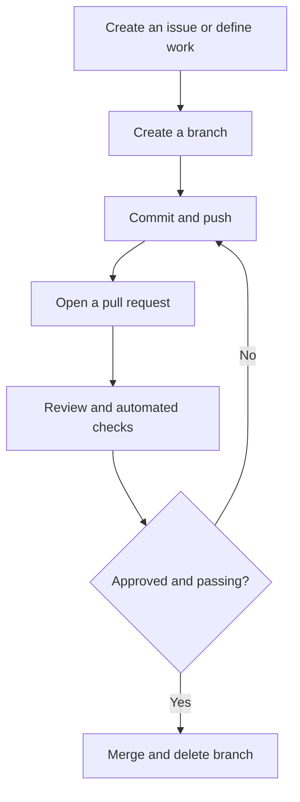

# GH-900 GitHub Foundations Study Guide

> **Independent AI-assisted resource — SOURCE-VALIDATED.** Objective coverage, citations, volatility labels, links, and exam-integrity compliance were checked on August 31, 2026; this is not a guarantee that the guide is error-free or current after that date. See the [source-validation record](../docs/SOURCE-VALIDATION.md). The [official GH-900 blueprint](https://learn.microsoft.com/en-us/credentials/certifications/resources/study-guides/gh-900) is authoritative.

**Current baseline:** Skills at a glance as of January 2026<br>
**Upcoming blueprint change:** None announced on the official study guide as of August 31, 2026.<br>
**Official source:** [GH-900 study guide](https://learn.microsoft.com/en-us/credentials/certifications/resources/study-guides/gh-900)<br>
**Primary certification alignment:** GitHub Foundations (GH-900)<br>
**Secondary benefit:** The GitHub platform knowledge assumed by GitHub Copilot (GH-300)

> **VERIFY CURRENT:** Recheck pricing, plan names, feature availability, previews, UI paths, quotas, retention, and command syntax in the linked official documentation. Those details are synchronized only to the `last_verified` date above and can change without an exam-blueprint revision.

---

## Purpose of this guide

GitHub makes more sense when you stop treating it as a collection of screens and learn it as a system:

1. **Git** records the history of files.
2. **GitHub repositories** store and share Git history.
3. **Issues, pull requests, Discussions, and Projects** coordinate people and work.
4. **Actions and security features** check and automate the work.
5. **Teams, permissions, rulesets, and policies** govern what people and tools may do.
6. **Copilot** works inside that system; it does not replace it.

This guide covers all seven domains in the current GH-900 study guide, but it is written to help you use GitHub rather than merely recognize exam terms.

### How to use this guide

Read the relevant part, reproduce its example in a disposable repository, and explain the associated distinctions in your own words. New learners can follow the parts in order; experienced learners can use the domain map and readiness checklist to target gaps.

> **About related items:** A `Related item:` callout adds prerequisite, operational, architectural, or adjacent context that makes the current topic easier to understand. It is useful supporting knowledge, not a claim that the item appears verbatim in the published exam objectives.

### Current GH-900 domain map

| Domain | Exam weight | Where it appears here |
|---|---:|---|
| Understand Git and GitHub basics | 25–30% | Parts 1–4 |
| Work with GitHub repositories | 10–15% | Parts 5–6 |
| Collaborate using GitHub | 10–15% | Parts 7–8 |
| Apply modern development practices | 10–15% | Parts 9–11 |
| Manage projects with GitHub | 5–10% | Part 12 |
| Understand privacy, security, and administration | 10–15% | Parts 13–15 |
| Explore the GitHub community | 5–10% | Part 16 |

The percentages come from the [official GH-900 study guide](https://learn.microsoft.com/en-us/credentials/certifications/resources/study-guides/gh-900). GitHub changes frequently, so recheck that page shortly before taking the exam.

---

# Part 1: Version control, Git, and GitHub

> **Primary references for this part:** [About Git](https://docs.github.com/en/get-started/using-git/about-git), the [Git reference manual](https://git-scm.com/docs), and [Pro Git](https://git-scm.com/book/en/v2).

## 1.1 What version control solves

Version control records changes to files over time. It lets a team answer:

- Who changed this line?
- Why was the change made?
- What did the project look like last Tuesday?
- Which changes belong to a particular feature?
- Can two people work in parallel?
- Can we review a change before it reaches production?
- Can we safely undo a bad change?

Without version control, teams create copies such as `final`, `final-v2`, and `final-really-final`. Those copies do not explain the relationship between changes and are difficult to merge. Version control gives every accepted change an identity and a place in history.

### Centralized versus distributed version control

| Model | How it works | Important implication |
|---|---|---|
| Centralized | The authoritative history resides on a central server | Many operations require access to that server |
| Distributed | Every clone normally contains the complete repository history | You can commit, inspect history, and create branches locally |

Git is distributed. GitHub is a hosted collaboration platform built around Git repositories.

> **Related item:** Distributed history improves resilience and offline work, but a clone is not a complete backup of GitHub metadata such as issues, pull requests, Actions settings, teams, and policies. Repository history and platform configuration need different continuity plans.

> **Git is the version-control system. GitHub is a service that hosts Git repositories and adds collaboration, automation, security, and administration.**

You can use Git without GitHub, and GitHub also supports tasks through its website and APIs. Most real workflows use both.

## 1.2 Git’s snapshot model

Git thinks primarily in **snapshots**, not as a sequence of independently saved files. A commit represents the state of the tracked project at one point in time, plus metadata such as:

- Author and committer
- Timestamp
- Commit message
- Parent commit or commits
- A cryptographic object identifier

If a file did not change, Git can efficiently refer to existing content rather than store a wasteful new copy.

### The four places to keep straight

| Place | Meaning |
|---|---|
| Working tree | The files currently on disk that you edit |
| Staging area/index | The exact changes selected for the next commit |
| Local repository | Commits and history stored in the local `.git` directory |
| Remote repository | A Git repository elsewhere, commonly on GitHub |

The normal path is:

```text
edit → stage → commit → push
```

These are separate decisions. Saving a file does not stage it. Staging does not commit it. Committing locally does not send it to GitHub.

## 1.3 Core Git vocabulary

| Term | Practical meaning |
|---|---|
| Repository | Project files plus their Git history |
| Commit | An identified snapshot with a message and parent history |
| Branch | A movable name pointing to a line of commits |
| Default branch | The repository’s primary branch, commonly `main` |
| Tag | A named reference, usually used to mark a fixed release |
| `HEAD` | The currently checked-out commit, normally through a branch |
| Remote | A named reference to another Git repository |
| `origin` | Conventional name for the remote from which you cloned |
| `upstream` | Conventional name for the original repository behind your fork |
| Clone | A local copy of a repository and its history |
| Fork | A GitHub-side repository copy under a different account |
| Merge | Combine histories, sometimes creating a merge commit |
| Rebase | Replay commits onto a different base |
| Conflict | A change Git cannot combine automatically |
| SHA/object ID | Identifier derived from Git object content |
| Tracked file | A file Git knows about |
| Untracked file | A file present in the working tree but not yet tracked |

### Branches are lightweight pointers

A branch is not a full copy of every file. It is a movable reference to a commit. When you commit on a branch, the branch pointer advances. This makes branching fast and encourages short-lived branches for isolated work.

### A commit identifier is not a version number

A Git object ID identifies content and history. A human-friendly release such as `v2.1.0` is normally represented with a tag. GitHub can then build a **release** around the tag and add release notes and downloadable assets.

---

# Part 2: Install, configure, and authenticate

> **Primary references for this part:** [Set up Git](https://docs.github.com/en/get-started/git-basics/set-up-git), [about authentication to GitHub](https://docs.github.com/en/authentication/keeping-your-account-and-data-secure/about-authentication-to-github), and [caching GitHub credentials](https://docs.github.com/en/get-started/git-basics/caching-your-github-credentials-in-git).

## 2.1 Your main ways to work with GitHub

| Tool | Best for |
|---|---|
| GitHub.com | Repository settings, issues, pull requests, reviews, Projects, administration |
| Git command line | Precise local version-control work and automation |
| GitHub CLI (`gh`) | GitHub operations such as creating PRs, issues, and releases from a terminal |
| GitHub Desktop | Visual local Git workflow without memorizing commands |
| VS Code Git integration | Everyday source control inside the editor |
| `github.dev` | Lightweight browser editing; no full compute environment |
| GitHub Codespaces | Cloud-hosted development environment with compute and terminal access |
| GitHub Mobile | Notifications, issues, PR review, and lightweight collaboration |

These are interfaces to overlapping capabilities. For example, you can create a branch on GitHub.com, with Git, in Desktop, or in VS Code.

## 2.2 Basic local configuration

After installing Git, establish the identity recorded in new commits:

```bash
git config --global user.name "Chris Example"
git config --global user.email "chris@example.com"
git config --global init.defaultBranch main
git config --global --list
```

`--global` applies settings to your user. Without it, a configuration can be repository-specific. Git’s commit email should correspond to an email associated with your GitHub account if you want GitHub to attribute the commit to you. GitHub also supports a privacy-protecting `noreply` email address.

## 2.3 Authentication is not commit identity

These are different:

- `user.name` and `user.email` identify the author recorded in a commit.
- Authentication proves to GitHub that you may read or write a repository.

### Common authentication choices

| Method | Typical use | Notes |
|---|---|---|
| HTTPS with Git Credential Manager | Convenient interactive Git use | Credentials are stored through a secure credential helper |
| SSH key | Frequent command-line use | Public key is registered with GitHub; private key stays with you |
| GitHub CLI authentication | GitHub CLI and optional Git credential setup | `gh auth login` guides configuration |
| Personal access token | API, automation, or HTTPS situations | Prefer fine-grained tokens and least privilege where supported |
| GitHub App token | Application and service integration | Installation-scoped and generally preferable to a shared user token for apps |
| `GITHUB_TOKEN` | Actions workflow access | Temporary repository-scoped token whose permissions should be minimized |

A normal GitHub account password is not used as the password for Git operations over HTTPS.

### HTTPS versus SSH

Neither is universally “more professional.” Choose based on your environment:

- HTTPS is easy through Git Credential Manager and often works through corporate networks.
- SSH is convenient once keys are configured and avoids repeated interactive credential prompts.
- Organizations may impose authentication policies, SAML SSO requirements, or network restrictions.

Useful checks:

```bash
gh auth login
gh auth status
ssh -T git@github.com
git remote -v
```

Never put tokens, passwords, client secrets, private keys, or cloud credentials in a repository.

> **Related item:** SSH proves control of a private key; HTTPS credential helpers and tokens use a different authentication path. Both still rely on GitHub authorization, organization policy, and repository permissions to decide what the authenticated identity may do.

---

# Part 3: The essential Git workflow

> **Primary references for this part:** [GitHub flow](https://docs.github.com/en/get-started/using-github/github-flow), the [Git reference manual](https://git-scm.com/docs), and [pull-request documentation](https://docs.github.com/en/pull-requests).

## 3.1 Start or copy a repository

Create a new local repository:

```bash
mkdir terraform-demo
cd terraform-demo
git init
```

Clone an existing repository:

```bash
git clone https://github.com/OWNER/REPOSITORY.git
cd REPOSITORY
```

`git init` creates Git history around an existing directory. `git clone` copies an existing repository, its history, and a default remote named `origin`.

## 3.2 Inspect before acting

```bash
git status
git diff
git diff --staged
git log --oneline --graph --decorate --all
```

- `git status` is the safest first command when uncertain.
- `git diff` shows unstaged changes.
- `git diff --staged` shows what the next commit will contain.
- `git log` shows committed history.

Build the habit of inspecting both the working-tree diff and the staged diff before committing.

## 3.3 Stage and commit intentionally

```bash
git add README.md
git add modules/network/
git commit -m "Add network module documentation"
```

For more control, interactively stage parts of files:

```bash
git add -p
```

A good commit is:

- Focused on one logical change
- Small enough to review
- Described with an imperative message such as `Add private endpoint validation`
- Free of generated files, temporary output, and secrets

The staging area lets you turn a messy working session into clear commits.

## 3.4 Work on a branch

```bash
git switch -c feature/private-key-vault
git branch
git switch main
git switch feature/private-key-vault
```

Older material may use `git checkout`; it can both switch branches and restore files. Modern Git provides `git switch` for branches and `git restore` for working-tree/staging operations, which is conceptually clearer.

## 3.5 Synchronize with GitHub

```bash
git fetch origin
git pull --ff-only origin main
git push -u origin feature/private-key-vault
```

Important distinctions:

| Command | What it does |
|---|---|
| `git fetch` | Downloads remote commits and updates remote-tracking references; does not change your working branch |
| `git pull` | Fetches, then integrates into the current branch using merge or rebase configuration |
| `git push` | Sends local commits and updates a remote reference if allowed |

`git fetch` is a safe way to learn what changed before deciding how to integrate it. `git pull --ff-only` refuses to create a surprise merge commit when the local and remote histories have diverged.

> **Related item:** A remote-tracking branch such as `origin/main` is your local record of the remote branch at the last fetch. It can be stale; fetching updates that record without changing your working branch.

`-u` sets an upstream tracking relationship so later `git push` and `git pull` can omit the remote and branch names.

## 3.6 Merge a branch

```bash
git switch main
git pull --ff-only
git merge feature/private-key-vault
```

In collaborative GitHub work, you will more commonly merge through an approved pull request rather than directly into local `main`.

### Merge strategies on GitHub

| Strategy | Result | When it helps |
|---|---|---|
| Merge commit | Preserves branch topology and adds a merge commit | The branch’s internal history is meaningful |
| Squash and merge | Combines the PR’s changes into one commit | Feature-branch commits are noisy; clean `main` history desired |
| Rebase and merge | Replays individual PR commits linearly | Individual commits are already clean and should remain separate |

The organization should choose a strategy deliberately. “Linear history” is not automatically better; it trades visible branch structure for a simpler sequence.

## 3.7 Resolve a merge conflict

A conflict means Git needs a human decision. It is not a Git failure.

```bash
git status
```

A conflicted file may contain markers like:

```text
# <<<<<<< HEAD
current branch content
# =======
incoming branch content
# >>>>>>> feature/example
```

Resolve it by editing the file into the desired final content, removing the markers, then:

```bash
git add path/to/resolved-file
git commit
```

If you are in a merge and want to return to the pre-merge state:

```bash
git merge --abort
```

The correct resolution may use one side, the other side, or a new combination. Always run relevant tests after resolving conflicts.

## 3.8 Undo safely: restore, revert, reset

This is one of the most important Git distinctions.

| Command | Purpose | Shared-history safety |
|---|---|---|
| `git restore` | Restore working-tree content or unstage changes | Normally local and safe when target is understood |
| `git revert` | Create a new commit that reverses an earlier commit | Preferred for commits already shared |
| `git reset` | Move a branch and optionally change index/working tree | Can rewrite history or discard work |

Examples:

Discard uncommitted changes in one file:

```bash
git restore main.tf
```

Unstage without discarding the edit:

```bash
git restore --staged main.tf
```

Reverse a published commit by adding a new commit:

```bash
git revert COMMIT_ID
```

Move the current branch back but retain the changes in the working tree:

```bash
git reset --mixed HEAD~1
```

`git reset --hard` can irreversibly discard tracked working-tree changes. Do not use it casually, and avoid rewriting history that other people may have based work on.

> **Exam and practice rule:** revert shared history; reset only when you understand the local-history consequences.

## 3.9 Other useful commands

```bash
git show COMMIT_ID
git blame path/to/file
git stash push -m "WIP before branch switch"
git stash list
git stash pop
git tag -a v1.0.0 -m "Release v1.0.0"
git remote -v
git remote add upstream https://github.com/ORIGINAL/REPOSITORY.git
```

- `show` inspects an object, often a commit and its patch.
- `blame` shows the last commit affecting each line; use it to find context, not to assign personal blame.
- `stash` temporarily shelves local changes, but should not become permanent storage.
- Annotated tags carry metadata and are normally preferred for releases.
- `upstream` is commonly used to track the original repository when working from a fork.

---

# Part 4: Files Git needs you to understand

> **Primary references for this part:** [Writing on GitHub](https://docs.github.com/en/get-started/writing-on-github), [repository documentation](https://docs.github.com/en/repositories), and [about CODEOWNERS](https://docs.github.com/en/repositories/managing-your-repositorys-settings-and-features/customizing-your-repository/about-code-owners).

## 4.1 `.gitignore`

`.gitignore` describes intentionally untracked files Git should ignore. For Terraform, common entries include:

```gitignore
.terraform/
*.tfstate
*.tfstate.*
crash.log
crash.*.log
*.tfplan
.env
```

Do **not** ignore `.terraform.lock.hcl` for a normal root module; committing it helps make provider selection reproducible.

`.gitignore` does not remove a file that is already tracked. If a secret was committed, adding it to `.gitignore` does not erase it from history. Revoke or rotate the credential first, then follow an approved history-cleanup process if necessary.

## 4.2 `.gitattributes`

`.gitattributes` controls path-specific Git behavior such as line-ending normalization, language detection, diffs, merges, and Git LFS treatment.

Example:

```gitattributes
* text=auto
*.sh text eol=lf
*.ps1 text eol=crlf
*.png binary
```

Use this when a cross-platform team needs predictable repository line endings. Do not confuse it with `.gitignore`: attributes govern tracked content; ignore rules control untracked-path discovery.

## 4.3 Repository documentation and community files

| File | Purpose |
|---|---|
| `README.md` | Explains what the project is and how to start |
| `LICENSE` | States legal permissions and obligations |
| `CONTRIBUTING.md` | Explains how to propose changes |
| `CODE_OF_CONDUCT.md` | Defines expected community behavior |
| `SECURITY.md` | Explains how to report vulnerabilities safely |
| `SUPPORT.md` | Directs users to appropriate support channels |
| `CODEOWNERS` | Maps paths to responsible users or teams |
| `CHANGELOG.md` | Summarizes notable release changes |

A repository without a license is not automatically open source merely because the public can view it. A public repository needs an explicit license if others are to know what reuse is permitted.

## 4.4 Markdown essentials

GitHub uses GitHub Flavored Markdown in issues, pull requests, Discussions, wikis, and `.md` files.

````markdown
# Heading 1
## Heading 2

**bold** and *italic*

- Bullet
- Another bullet

1. First
2. Second

[GitHub](https://github.com)

`inline code`

```hcl
resource "azurerm_resource_group" "example" {
  name     = "rg-example"
  location = "eastus2"
}
```

- [ ] Open task
- [x] Completed task

> Quoted text
````

Useful collaboration syntax:

- `@username` mentions a person.
- `@organization/team-name` mentions a team when permitted.
- `#123` links to an issue or pull request in the same repository.
- `OWNER/REPOSITORY#123` links across repositories.
- `Closes #123` in a pull-request description can automatically close a linked issue when the PR merges.

Use descriptive link text and alt text for accessibility.

---

# Part 5: GitHub accounts, products, and hierarchy

> **Primary references for this part:** [Types of GitHub accounts](https://docs.github.com/en/get-started/learning-about-github/types-of-github-accounts), [roles in an organization](https://docs.github.com/en/organizations/managing-peoples-access-to-your-organization-with-roles/roles-in-an-organization), [repository roles](https://docs.github.com/en/organizations/managing-user-access-to-your-organizations-repositories/managing-repository-roles/repository-roles-for-an-organization), and the [GitHub plans comparison](https://github.com/pricing).

## 5.1 Account and ownership model

| Object | Owns or contains | Typical purpose |
|---|---|---|
| Personal account | Personal repositories, gists, settings | An individual identity on GitHub |
| Organization | Repositories, members, teams, policies | Shared ownership for a company or community |
| Enterprise account | One or more organizations and enterprise policies | Central governance and billing |
| Repository | Code, Git data, issues, PRs, Actions, settings | A project and its collaboration boundary |
| Team | Organization members and optional child teams | Permission assignment and review ownership |

Your personal account is your identity even when you work in organization-owned repositories. Do not create a shared “team user” to avoid managing individual access; shared identity weakens attribution and lifecycle control.

### GitHub Enterprise Cloud and Server

- **GitHub Enterprise Cloud (GHEC)** provides enterprise capabilities on GitHub’s hosted service.
- **GitHub Enterprise Server (GHES)** is self-hosted by the customer and has its own release cadence.
- **Enterprise Managed Users (EMU)** lets an enterprise’s identity provider provision and control managed user accounts. These identities are intended for enterprise work and have different constraints from personal GitHub accounts.

Feature availability varies by plan and deployment. Never assume a feature present on GitHub.com is already available on a particular GHES version.

### Product plans versus account types

Do not confuse the identity/ownership model with the commercial plan:

- GitHub Free and Pro are commonly associated with personal use.
- GitHub Free for organizations and GitHub Team provide organization collaboration at different entitlement levels.
- GitHub Enterprise adds enterprise governance and is available through Cloud and Server offerings.

An **organization** is an ownership and collaboration object; **GitHub Team** is a plan. An **enterprise account** is a governance object; **GitHub Enterprise Cloud** is the hosted enterprise product. Limits and entitlements change, so check the current [GitHub plans comparison](https://github.com/pricing) rather than memorizing transient numbers.

## 5.2 Repository visibility

| Visibility | Who can access it? |
|---|---|
| Public | Anyone can view; write access still requires permission |
| Private | Only explicitly authorized users and teams, subject to enterprise controls |
| Internal | Members of the enterprise, subject to policies and repository permissions |

Internal is not “public within one organization”; it is an enterprise visibility level. Availability depends on the GitHub product.

Changing visibility can affect forks, Actions, Pages, stars, security settings, and access. Treat it as a governance decision, not a cosmetic setting.

## 5.3 Repository roles

Standard repository roles progress approximately as follows:

| Role | Intended scope |
|---|---|
| Read | View and discuss the project |
| Triage | Manage issues and PRs without write access to code |
| Write | Push code and manage ordinary collaboration |
| Maintain | Manage the repository without access to sensitive/destructive administration |
| Admin | Full repository administration, including access and settings |

Organizations may also define custom repository roles on supported plans. Apply least privilege: give the smallest role needed for the work.

### Organization roles and teams

- **Organization owners** have broad administrative authority.
- **Members** participate under organization policy and repository access.
- **Outside collaborators** may receive access to selected repositories without full membership.
- **Teams** group members for repository access, mentions, review requests, and CODEOWNERS.

Base permissions provide a default repository access level for organization members. Additional access can then be granted directly or through teams. Avoid excessive one-off grants when a maintained team represents the responsibility better.

---

# Part 6: Creating and managing repositories

> **Primary references for this part:** [Repository documentation](https://docs.github.com/en/repositories), the [GitHub Changelog](https://github.blog/changelog/), and [Feature Preview documentation](https://docs.github.com/en/get-started/using-github/exploring-early-access-releases-with-feature-preview).

## 6.1 Creating a repository

When creating a repository on GitHub, you normally choose:

- Owner
- Name and description
- Visibility
- Optional README
- Optional `.gitignore` template
- Optional license

If you already have a local repository with commits, avoid initializing the GitHub repository with conflicting starter commits unless you plan to reconcile the histories.

Connect an existing local repository:

```bash
git remote add origin https://github.com/OWNER/REPOSITORY.git
git push -u origin main
```

Or with the GitHub CLI:

```bash
gh repo create OWNER/REPOSITORY --private --source=. --remote=origin --push
```

## 6.2 Templates

Keep these distinct:

| Template type | What it standardizes |
|---|---|
| Repository template | Starting files and directory structure for a new repository |
| Issue form/template | Information collected when creating an issue |
| Pull-request template | Information authors should provide in a PR description |
| Workflow template | Suggested GitHub Actions workflow for repositories in an organization |
| Organization `.github` repository | Default community health files and workflow templates in supported locations |

Templates create a consistent starting point, but they do not enforce continued compliance.

## 6.3 Branches, tags, and releases

- A **branch** moves as new commits are added.
- A **tag** normally marks a particular commit.
- A **GitHub release** is built around a tag and can include notes, links, and binary assets.

Use a protected default branch for accepted work. Use feature branches for proposed changes. Use annotated tags and releases for versions that users or deployment processes need to identify.

Semantic versioning commonly uses `MAJOR.MINOR.PATCH`:

- Major: incompatible changes
- Minor: backward-compatible functionality
- Patch: backward-compatible fixes

GitHub does not require semantic versioning; it is a project convention.

> **Related item:** A Git tag identifies a Git object; a GitHub Release adds a human-facing release page, notes, and assets around a tag. A package version may use the same number but is published through a separate registry lifecycle.

## 6.4 Repository insights and signals

| Feature | Meaning |
|---|---|
| Stars | Users bookmark or show interest in a repository |
| Watch | A user subscribes to selected repository notifications |
| Forks | Server-side copies used for independent development or contribution |
| Traffic | Views and clones over a limited reporting window |
| Contributors | Contribution activity based on repository history |
| Pulse/activity | Recent collaboration and change activity |
| Dependency graph | Repository dependencies and dependents where detectable |
| Network graph | Fork relationships and commit history |

A star is not an access grant, a watch is not a fork, and a fork is not a branch.

### Feature Preview and change awareness

GitHub may offer early access to selected capabilities through **Feature Preview**. Preview features can change, have limited support, or be removed, so do not treat preview behavior as a permanent production contract. GitHub’s changelog, release notes, documentation, and status page are useful for distinguishing a new feature from a service incident or a feature that is not enabled for your account.

- [GitHub Changelog](https://github.blog/changelog/)
- [GitHub Status](https://www.githubstatus.com/)
- [Feature Preview documentation](https://docs.github.com/en/get-started/using-github/exploring-early-access-releases-with-feature-preview)

## 6.5 Maintain, archive, transfer, or delete

Good maintenance includes:

- Reviewing stale issues and PRs
- Updating dependencies
- Rotating credentials and removing unused access
- Keeping documentation, templates, and ownership accurate
- Reviewing rulesets and Actions permissions
- Publishing releases and deprecation notices
- Responding to vulnerability reports

**Archive** a repository when it should become read-only but remain available. **Transfer** changes ownership and may affect access and automation. **Delete** is destructive and should follow the organization’s retention and recovery procedures.

---

# Part 7: GitHub Flow and pull requests

> **Primary references for this part:** [GitHub flow](https://docs.github.com/en/get-started/using-github/github-flow) and [pull-request documentation](https://docs.github.com/en/pull-requests).

## 7.1 GitHub Flow

GitHub Flow is a lightweight, branch-based collaboration model:



The default branch should remain deployable according to the project’s standards. Work occurs on a branch, is discussed and validated in a pull request, and merges only when ready.

## 7.2 Pull requests are proposals, not just diffs

A pull request (PR) proposes merging changes from a **head branch** into a **base branch**. It provides:

- A diff
- Commit history
- Conversation
- Review decisions
- Automated checks
- Links to issues and Projects
- Merge controls

Open a **draft PR** when the work is visible and useful for early feedback but not ready for formal approval or merge.

### A strong PR description

Include:

- Problem or goal
- What changed
- What deliberately did not change
- How it was tested
- Security and operational implications
- Screenshots or plan excerpts when useful
- Rollback considerations
- Linked issue

For Terraform, summarize additions, changes, replacements, deletions, permission changes, public exposure, and expected downtime. Do not paste secrets or excessively large plans into a PR.

## 7.3 Reviews

A reviewer can generally:

- **Comment** without a formal approval decision
- **Approve** the proposed changes
- **Request changes** that should be resolved before merge

Review comments may target the overall PR, a file, or specific lines. Suggested changes can provide a directly applicable patch. Conversations may need to be resolved before merge if a rule requires it.

Good review examines:

- Correctness
- Security and privacy
- Maintainability
- Tests and validation
- Scope and unintended changes
- Documentation
- Consistency with project conventions

Review the diff and the behavior, not merely whether automated checks are green.

## 7.4 Link PRs and issues

An issue usually represents a problem, request, decision, or unit of work. A PR represents a proposed implementation. Link them so the reason and implementation remain connected.

Keywords such as these can close an issue when the PR reaches the repository’s default branch:

```text
Closes #123
Fixes #123
Resolves #123
```

Merely mentioning `#123` creates a reference but does not necessarily close it.

## 7.5 Fork-based contribution

Use a fork when you do not have permission to create branches in the original repository or when independent ownership is useful.

Typical setup:

```bash
git clone https://github.com/YOUR-ACCOUNT/PROJECT.git
cd PROJECT
git remote add upstream https://github.com/ORIGINAL-OWNER/PROJECT.git
git fetch upstream
git switch main
git merge --ff-only upstream/main
git push origin main
```

You push a branch to your fork (`origin`) and open a PR against the original repository (`upstream`). A fork is a GitHub repository; a branch is a Git reference inside a repository.

> **Related item:** Fork pull requests cross a trust boundary. Workflows should treat fork code and event text as untrusted and avoid exposing write tokens, secrets, or privileged self-hosted runners merely because the change appears in a pull request.

---

# Part 8: Issues, Discussions, notifications, and publishing

> **Primary references for this part:** [Issues](https://docs.github.com/en/issues), [Discussions](https://docs.github.com/en/discussions), [notifications](https://docs.github.com/en/subscriptions-and-notifications), [gists](https://docs.github.com/en/get-started/writing-on-github/editing-and-sharing-content-with-gists/creating-gists), [wikis](https://docs.github.com/en/communities/documenting-your-project-with-wikis/about-wikis), and [GitHub Pages](https://docs.github.com/en/pages).

## 8.1 Issues

Issues can track:

- Bugs
- Features
- Tasks
- Questions
- Decisions
- Incidents or follow-up work

Useful issue metadata includes:

| Feature | Purpose |
|---|---|
| Assignee | Person currently responsible for action |
| Label | Flexible categorization such as `bug`, `security`, or `terraform` |
| Milestone | Groups issues and PRs toward a target |
| Project | Adds the item to a planning view |
| Issue type | Classifies work using configured types |
| Sub-issue | Breaks a larger issue into trackable units |
| Dependency/blocking relationship | Shows sequencing constraints |

Issue templates and forms collect consistent information. Forms can require structured fields; a Markdown template provides suggested prose but is less deterministic.

Use filters and search qualifiers to find work:

```text
is:issue is:open label:security assignee:@me
is:pr is:open review-requested:@me
repo:OWNER/REPO is:issue milestone:"v2.0"
```

## 8.2 Discussions

Use GitHub Discussions for open-ended community or team conversation such as:

- Questions and answers
- Ideas
- Announcements
- General design conversation
- Community polls

Use an issue when there is a concrete trackable outcome. A useful Discussion can later become an issue when a decision creates actionable work.

## 8.3 Notifications

Notifications are created through activities such as:

- Being directly mentioned
- Being assigned
- Being requested as a reviewer
- Participating in a conversation
- Watching a repository
- Subscribing to a thread

You can tune watching per repository and unsubscribe from noisy threads. Use notification filters and saved searches to establish an intentional review queue rather than treating email as the only source of truth.

## 8.4 Saved replies

Saved replies reuse common responses, such as asking for a minimal reproduction or explaining support policy. They improve consistency but should be personalized when the situation deserves it.

## 8.5 Gists, wikis, and Pages

| Feature | Best use |
|---|---|
| Gist | Small code snippets or notes backed by Git |
| Wiki | Repository-associated documentation maintained as pages |
| GitHub Pages | Static website published from a repository or Actions workflow |

Public gists are discoverable; secret gists are unlisted, not a secure secret-storage mechanism. GitHub Pages publishes static content and must not expose secrets embedded in generated assets.

---

# Part 9: GitHub Actions fundamentals

> **Primary references for this part:** [GitHub Actions](https://docs.github.com/en/actions), [workflow concepts](https://docs.github.com/en/actions/concepts/workflows-and-actions/workflows), [secure use](https://docs.github.com/en/actions/reference/security/secure-use), and [reusing workflows](https://docs.github.com/en/actions/how-tos/reuse-automations/reuse-workflows).

## 9.1 What Actions does

GitHub Actions automates work in response to repository events, manual dispatch, schedules, or reusable calls. Common uses include:

- Build and test
- Lint and format checks
- Security scanning
- Package and release publishing
- Infrastructure plan and deployment
- Issue and PR automation

Actions configuration is stored as YAML under:

```text
.github/workflows/
```

## 9.2 Workflow vocabulary

| Term | Meaning |
|---|---|
| Workflow | YAML-defined automated process |
| Event/trigger | Activity that starts a workflow, such as `pull_request` |
| Job | Collection of steps run on one runner; jobs can depend on other jobs |
| Step | A shell command or an action within a job |
| Action | Reusable unit that performs a task |
| Runner | Machine that executes a job |
| Marketplace | Directory where actions and apps can be discovered |
| Artifact | File retained from a workflow run, such as logs or build output |
| Cache | Reused dependencies intended to speed later runs |
| Environment | Deployment target with secrets and protection rules |

### Minimal Terraform validation example

```yaml
name: Terraform validation

on:
  pull_request:
    paths:
      - "**/*.tf"
      - ".github/workflows/terraform.yml"

permissions:
  contents: read

jobs:
  validate:
    runs-on: ubuntu-latest
    steps:
      - name: Check out repository
        uses: actions/checkout@v5

      - name: Set up Terraform
        uses: hashicorp/setup-terraform@v4

      - name: Check formatting
        run: terraform fmt -check -recursive

      - name: Initialize without backend
        run: terraform init -backend=false

      - name: Validate configuration
        run: terraform validate
```

This workflow checks code, but it becomes an enforcement control only when its status is required by a ruleset or branch protection rule.

## 9.3 Hosted and self-hosted runners

- **GitHub-hosted runners** are temporary environments operated by GitHub.
- **Self-hosted runners** are managed by you and may reach internal resources, but require patching, isolation, monitoring, and lifecycle controls.

Running untrusted pull-request code on a privileged self-hosted runner is dangerous. Treat workflow code as code execution, review it carefully, and isolate sensitive runners.

## 9.4 Workflow security

Important practices:

- Grant the `GITHUB_TOKEN` only required permissions.
- Pin third-party actions to trusted versions; for high assurance, pin to a full commit SHA and manage updates.
- Prefer OpenID Connect (OIDC) for short-lived cloud authentication instead of long-lived Azure client secrets.
- Protect deployment environments with approval rules where appropriate.
- Do not print secrets or sensitive plan output.
- Avoid executing untrusted PR content with privileged credentials.
- Review dependency and action provenance.
- Separate plan and apply, and protect production deployment.

> **Related item:** CI continuously integrates and validates changes; continuous delivery keeps changes deployable through an approved release process; continuous deployment automatically releases qualifying changes. Teams often say “CI/CD” without distinguishing the final approval boundary.

### Reusable workflows versus composite actions

| Mechanism | Reuses |
|---|---|
| Reusable workflow | One or more jobs, including runners, permissions, and job orchestration |
| Composite action | A sequence of steps invoked inside a job |

An organization can centralize its Terraform validation as a reusable workflow and have many repositories call it. The caller can reference a branch, tag, or commit; pinning to an immutable commit is strongest against unexpected changes.

---

# Part 10: Development environments

> **Primary references for this part:** The [`github.dev` editor](https://docs.github.com/en/codespaces/the-githubdev-web-based-editor), [Codespaces deep dive](https://docs.github.com/en/codespaces/about-codespaces/deep-dive), and [introduction to dev containers](https://docs.github.com/en/codespaces/setting-up-your-project-for-codespaces/adding-a-dev-container-configuration/introduction-to-dev-containers).

## 10.1 GitHub Desktop and Mobile

GitHub Desktop provides a graphical interface for cloning, branching, committing, synchronizing, resolving some conflicts, and opening pull requests. It is useful, but the underlying Git concepts still matter when a workflow becomes complicated.

GitHub Mobile supports notification triage, issues, pull requests, review, and collaboration. It is not intended to replace a full development environment.

## 10.2 `github.dev`

Press `.` while viewing a repository on GitHub, or change `github.com` to `github.dev`, to open a lightweight web editor.

It is useful for:

- Browsing and editing files
- Search and navigation
- Source-control operations
- Small changes from a browser

It does not provide the full compute environment of a codespace. There is no normal remote virtual machine in which to install arbitrary tools and run Terraform.

## 10.3 GitHub Codespaces

A codespace is a cloud-hosted development environment associated with a repository. It commonly includes:

- A containerized environment
- VS Code in the browser or desktop client
- Terminal and compute
- Forwarded ports
- Repository-specific configuration
- Secrets supplied through Codespaces settings

Codespaces consumes billable compute and storage according to the applicable plan and policy. Stop or delete unused codespaces appropriately.

## 10.4 Development containers

A `.devcontainer/devcontainer.json` file describes the development environment, often including:

- Base image or Dockerfile
- Tools and features
- VS Code extensions
- Port forwarding
- Initialization commands
- User and container settings

Example concept:

```json
{
  "name": "Terraform on Azure",
  "image": "mcr.microsoft.com/devcontainers/base:ubuntu",
  "features": {
    "ghcr.io/devcontainers/features/azure-cli:1": {},
    "ghcr.io/devcontainers/features/terraform:1": {},
    "ghcr.io/devcontainers/features/github-cli:1": {}
  }
}
```

A dev container makes the toolchain reproducible. A codespace is one hosted place that can run that dev-container configuration. Dev containers can also run locally in compatible tooling.

---

# Part 11: GitHub Copilot in the GitHub platform

> **Primary references for this part:** [GitHub Copilot documentation](https://docs.github.com/en/copilot) and the live [Copilot plans page](https://docs.github.com/en/copilot/get-started/plans).

GH-900 expects high-level familiarity, not the full GH-300 depth.

## 11.1 What Copilot can assist with

Depending on product, plan, client, policy, and feature availability, Copilot can help with:

- Inline code suggestions
- Chat and explanations
- Multi-file edits and Agent Mode
- Pull-request descriptions and summaries
- Code review
- Command-line assistance
- Issue-to-code or cloud-agent workflows
- Documentation and test generation

Where supported, users may select among multiple AI models. Model availability can depend on the subscription, enterprise or organization policy, client, and current service offering. Choosing a model changes the engine used for a request; it does not remove the need to supply relevant context or validate the result.

Copilot output is a proposal. The developer remains responsible for correctness, security, licensing considerations, and validation.

## 11.2 Plans and policy

Current individual offerings use more granular names than some exam language. Organizational offerings include Copilot Business and Enterprise, with administrative policy and licensing features. Plan names, limits, models, and entitlements change; review the live [GitHub Copilot plans page](https://docs.github.com/en/copilot/get-started/plans) near the exam.

Keep three questions separate:

1. **Entitlement:** Does the subscription include the feature?
2. **Policy:** Has the enterprise or organization allowed it?
3. **Client availability:** Does the current editor or GitHub surface support it?

## 11.3 Copilot and repository governance

Copilot can read relevant repository context and custom instructions where supported. It can help follow standards, but deterministic controls still matter:

```text
Instructions guide → Actions check → reviewers judge → rulesets block or allow
```

This relationship is foundational for GH-300. Copilot is a participant in the GitHub workflow, not the authority that approves its own changes.

---

# Part 12: GitHub Projects

> **Primary references for this part:** [GitHub Projects documentation](https://docs.github.com/en/issues/planning-and-tracking-with-projects) and the [Projects quickstart](https://docs.github.com/en/issues/planning-and-tracking-with-projects/learning-about-projects/quickstart-for-projects).

GitHub Projects is a flexible planning system that can track issues, pull requests, and draft items.

## 12.1 Views

| View | Best for |
|---|---|
| Table | Spreadsheet-like planning, sorting, grouping, and bulk editing |
| Board | Status-oriented flow such as backlog, in progress, review, done |
| Roadmap | Work scheduled across time |

Different views can show the same underlying items. A view is a lens, not a duplicate project.

## 12.2 Fields and organization

Projects can use:

- Built-in metadata from issues and PRs
- Single-select fields such as Status or Priority
- Text and number fields
- Date fields
- Iterations
- Repository, assignee, labels, and milestones

Use **labels** for repository-level categorization, **milestones** for a repository delivery target, and **project fields** for portfolio-specific planning across repositories.

## 12.3 Workflows and insights

Built-in or configured workflows can change project fields when events occur—for example, set Status to Done when an item closes. Project insights can visualize progress and item distribution.

Example project for a Terraform platform:

| Field | Sample values |
|---|---|
| Status | Backlog, Ready, In progress, Review, Done |
| Priority | P0, P1, P2, P3 |
| Service | Networking, Identity, Compute, Governance |
| Environment | Dev, QA, Production |
| Target iteration | Two-week iteration |

Do not create dozens of fields merely because you can. Every field should support a decision, filter, workflow, or report.

---

# Part 13: Authentication, privacy, and access security

> **Primary references for this part:** [About authentication to GitHub](https://docs.github.com/en/authentication/keeping-your-account-and-data-secure/about-authentication-to-github), [two-factor authentication](https://docs.github.com/en/authentication/securing-your-account-with-two-factor-authentication-2fa/about-two-factor-authentication), and [passkeys](https://docs.github.com/en/authentication/authenticating-with-a-passkey).

## 13.1 Secure the user account

Use:

- A unique password through a password manager
- Two-factor authentication
- Passkeys or security keys where appropriate
- Reviewed and current recovery methods
- Periodic review of sessions, authorized OAuth apps, GitHub Apps, SSH keys, and tokens

### 2FA and passkeys

Two-factor authentication requires a second factor beyond the password. Passkeys use public-key cryptography and can provide passwordless, phishing-resistant authentication depending on device and setup. Recovery codes must be stored securely and separately.

## 13.2 Token principles

For personal access tokens:

- Prefer fine-grained access where supported.
- Restrict the token to required repositories and permissions.
- Set an appropriate expiration.
- Store it in an approved secret manager or credential store.
- Rotate and revoke it when no longer needed.
- Never commit it.

A classic PAT uses broad scopes and may still be necessary for some operations. “Fine-grained” does not remove the need to verify the exact permissions and organizational approval.

## 13.3 Least privilege and separation of duties

Examples:

- Developers get write access, not repository admin, unless needed.
- Platform owners administer rules and reusable workflows.
- Security teams own security policy and escalation paths.
- Production deployment requires an environment approval.
- An author cannot satisfy all review requirements alone.

GitHub permissions answer **who can perform an operation**. Rulesets answer **what conditions a reference update must satisfy**. Actions answer **what automated checks or work run**.

---

# Part 14: Branch protection, rulesets, and ownership

> **Primary references for this part:** [Branch protection](https://docs.github.com/en/repositories/configuring-branches-and-merges-in-your-repository/managing-protected-branches/about-protected-branches), [rulesets](https://docs.github.com/en/repositories/configuring-branches-and-merges-in-your-repository/managing-rulesets/about-rulesets), [available rules](https://docs.github.com/en/repositories/configuring-branches-and-merges-in-your-repository/managing-rulesets/available-rules-for-rulesets), and [CODEOWNERS](https://docs.github.com/en/repositories/managing-your-repositorys-settings-and-features/customizing-your-repository/about-code-owners).

## 14.1 Branch protection versus rulesets

Both can protect important branches. Rulesets offer a newer, centrally manageable model that can target multiple repositories and provide clearer layering and evaluation. Exact availability depends on the GitHub product and repository visibility.

> **Related item:** CODEOWNERS answers who should review a path. A required code-owner review rule turns that routing information into enforcement. Either mechanism alone provides only half of the control.

Common controls include:

- Require a pull request before merging
- Require approvals
- Require code-owner review
- Dismiss stale approvals when new commits arrive
- Require status checks
- Require conversation resolution
- Require signed commits
- Require linear history
- Block force pushes and deletion
- Restrict who may push
- Require deployments to succeed

Do not assume administrators bypass a rule; bypass behavior is explicitly configured and should be tightly controlled and audited.

## 14.2 CODEOWNERS

A `CODEOWNERS` file maps paths to users or teams:

```text
# Default owners
* @contoso/platform-maintainers

# Terraform modules
/modules/ @contoso/terraform-maintainers

# Workflow changes
/.github/workflows/ @contoso/devops-platform @contoso/security

# Security policy owns itself
/SECURITY.md @contoso/security
```

GitHub can automatically request review from matching owners. But the file alone does not block merging. A branch protection rule or ruleset must require code-owner approval.

## 14.3 Guidance, checking, and enforcement

| Mechanism | Guides | Checks | Can block merge/use |
|---|:---:|:---:|:---:|
| README/standards document | Yes | No | No |
| Copilot instructions | Yes | No | No |
| PR template | Yes | No | No |
| Copilot code review | Yes | Partly | Not by itself |
| GitHub Actions workflow | No | Yes | Only if its check is required |
| CODEOWNERS | Routes review | No | Only with required owner review |
| Ruleset/branch protection | No | Evaluates conditions | Yes |
| Enterprise/organization policy | No | No | Yes for governed features |

This table is worth memorizing. Organizations often believe they enforce a rule when they have only written or automated it.

---

# Part 15: Repository and supply-chain security

> **Primary reference for this part:** [GitHub code security documentation](https://docs.github.com/en/code-security).

## 15.1 The main GitHub security capabilities

Names and packaging can evolve, but the concepts are stable:

| Capability | Purpose |
|---|---|
| Dependency graph | Identifies direct and transitive dependencies where supported |
| Dependency review | Shows dependency changes introduced by a PR |
| Dependabot alerts | Reports known vulnerable dependencies |
| Dependabot security updates | Proposes updates for vulnerable dependencies |
| Dependabot version updates | Proposes scheduled dependency updates |
| Secret scanning | Detects supported secret patterns in repository content/history |
| Push protection | Blocks or warns about detected secrets before they are pushed |
| Code scanning | Finds vulnerabilities and coding errors using tools such as CodeQL |
| Security overview | Aggregates risk and enablement across repositories for authorized administrators |
| Private vulnerability reporting | Gives security researchers a private reporting path |
| Security advisories | Coordinates vulnerability remediation and disclosure |

Some capabilities are available broadly for public repositories; private-repository availability depends on plan and configuration.

## 15.2 Dependabot concepts

- An **alert** says a dependency is known to be vulnerable.
- A **security update** proposes a version change to remediate an alert.
- A **version update** keeps dependencies current according to configuration, even without an active vulnerability.
- **Dependency review** examines what a PR adds, removes, or changes.

Automation does not eliminate review. A dependency update can introduce breaking behavior or supply-chain risk.

## 15.3 Secret response

If a secret is committed:

1. Revoke or rotate it immediately.
2. Determine scope and evidence of use.
3. Remove it from the current files.
4. Decide whether history rewriting is required under organizational policy.
5. Notify affected collaborators because history rewriting changes commit identities.
6. Add preventive controls such as push protection and secret-scanning alerts.

Deleting a file or adding it to `.gitignore` is not credential remediation.

> **Related item:** Secret scanning detects exposure; push protection attempts to prevent supported secrets from entering the repository; a vault or federated identity reduces the need to handle long-lived secrets at all. These controls address different stages of the secret lifecycle.

## 15.4 Audit and administration

Organization and enterprise audit logs help investigate administrative, access, policy, and security events. Retention, export, and streaming capabilities depend on the plan. Use audit data to answer who changed access, settings, policies, or protected resources; do not treat it as a substitute for application telemetry.

---

# Part 16: GitHub community, open source, and InnerSource

> **Primary references for this part:** [Open Source Guides](https://opensource.guide/), [GitHub Marketplace](https://github.com/marketplace), and [GitHub Sponsors](https://docs.github.com/en/sponsors).

## 16.1 Open source fundamentals

Open source is more than a public repository. A healthy project normally provides:

- A license
- A README
- Contribution guidance
- A code of conduct
- An issue and review process
- Maintainers and governance
- Security reporting guidance

GitHub Sponsors lets eligible developers and organizations receive financial support. GitHub Marketplace helps users discover GitHub Apps and Actions. Review an integration’s publisher, permissions, maintenance, and security posture before installing or using it.

## 16.2 Discover and follow

- **Follow** people or organizations to see relevant activity.
- **Star** repositories to mark interest.
- **Watch** repositories or threads to receive notifications.
- **Explore/search/topics** help discover projects.
- **Fork** creates a repository copy for independent work or contribution.

These actions have distinct purposes; none automatically grants write permission.

## 16.3 InnerSource

InnerSource applies open-source collaboration patterns inside an organization. A team may own a shared module while other internal teams contribute through issues and PRs.

A useful InnerSource repository includes:

- Clear ownership and support expectations
- Discoverable documentation and examples
- Contribution guidelines
- Issue and PR templates
- Automated validation
- Predictable review service levels
- A license or internal-use statement appropriate to company policy

For an Azure platform team, an internal Terraform module catalog is a natural InnerSource model: central maintainers protect interfaces and quality, while application teams contribute fixes and enhancements through the same governed workflow.

> **Related item:** InnerSource needs a contribution contract as well as readable code: ownership, support level, compatibility policy, review expectations, release process, and a path for teams to propose changes without bypassing maintainers.

---

# Part 17: A complete organizational workflow

> **Primary references for this part:** [GitHub flow](https://docs.github.com/en/get-started/using-github/github-flow), [workflow security](https://docs.github.com/en/actions/reference/security/secure-use), and [available rules for rulesets](https://docs.github.com/en/repositories/configuring-branches-and-merges-in-your-repository/managing-rulesets/available-rules-for-rulesets).

Consider a request to add a private Azure Key Vault to a Terraform repository.

## 17.1 Before development

- The organization owns the repository.
- A platform team has write or maintain access.
- `main` is protected by a ruleset.
- `CODEOWNERS` assigns `.tf` and workflow changes to appropriate teams.
- The repository has contribution, security, and Copilot instructions.
- A reusable Actions workflow performs formatting, validation, linting, and security checks.
- Azure authentication uses OIDC with an appropriately scoped identity.

## 17.2 During development

1. An issue records the requirement and acceptance criteria.
2. The developer creates a feature branch.
3. Git records focused local commits.
4. The branch is pushed to GitHub.
5. A draft PR makes the design visible early.
6. Actions validate the change.
7. Copilot may help explain, implement, test, or review, subject to instructions and policy.
8. Human reviewers examine the plan, permissions, exposure, and maintainability.
9. The author resolves findings and conversations.
10. Required checks and approvals allow the merge.
11. The PR closes the linked issue.
12. A protected deployment workflow handles environment promotion.

## 17.3 Where the standards live

| Standard | Example location/mechanism |
|---|---|
| “Use private endpoints” | Architecture docs and Copilot instructions |
| “Run Terraform validation” | Reusable Actions workflow |
| “Validation must pass” | Ruleset-required status check |
| “Platform team reviews `.tf` changes” | CODEOWNERS plus required owner approval |
| “No long-lived Azure secret” | OIDC workflow design and secret policy |
| “Only approved Actions may run” | Organization or enterprise Actions policy |
| “Production requires approval” | Protected GitHub environment |
| “Track who changed policy” | Organization/enterprise audit log |

This is GitHub as an engineering system: documentation shapes intent, automation provides evidence, people exercise judgment, and governance controls the final state.

---

# Part 18: Hands-on labs

Do these in a disposable repository. Avoid real credentials and production subscriptions.

## Lab 1: Create and inspect a repository

**Goal:** Understand working tree, staging, commits, and remote synchronization.

1. Create a private GitHub repository without starter files.
2. Locally create `README.md`, `.gitignore`, and a small `main.tf`.
3. Run `git status` after each edit.
4. Stage only `README.md`; compare `git diff` with `git diff --staged`.
5. Make two focused commits.
6. Add `origin` and push `main`.
7. Inspect the commits and file history on GitHub.com.

**You have learned it when:** you can explain why a saved file may be untracked, modified, staged, committed, or pushed.

## Lab 2: Use GitHub Flow

**Goal:** Complete a branch-and-PR cycle.

1. Create issue `Add required Terraform version`.
2. Create branch `feature/required-version`.
3. Add `versions.tf` and commit it.
4. Push the branch and open a draft PR.
5. Include `Closes #1`, testing, and impact in the description.
6. Mark it ready, review the diff, and merge it.
7. Delete the feature branch and update local `main`.

**You have learned it when:** you can distinguish the issue, branch, commit, PR, review, and merge.

## Lab 3: Resolve a conflict

**Goal:** Treat conflicts as a normal integration task.

1. Create two branches from the same commit.
2. On both branches, edit the same README line differently.
3. Merge the first branch.
4. Try to merge or update the second.
5. Inspect the conflict markers and `git status`.
6. Create the correct combined text, stage it, and finish the merge.
7. Inspect the graph with `git log --graph --oneline --all`.

**You have learned it when:** you can explain why the conflict occurred and how you selected the final content.

## Lab 4: Add Terraform checks

**Goal:** Understand workflows, jobs, steps, runners, and status checks.

1. Add a pull-request workflow that runs `fmt`, `init -backend=false`, and `validate`.
2. Open a PR containing deliberately unformatted Terraform.
3. Inspect the failed step and logs.
4. Correct the file and push another commit.
5. Watch the same PR update to a passing check.
6. Make the check required in a repository ruleset, if available in your plan.

**You have learned it when:** you can explain why an Actions check does not block merging until a rule requires it.

## Lab 5: Add ownership and governance

**Goal:** Connect teams, CODEOWNERS, and rulesets.

1. In an organization test repository, create a team or identify an existing one.
2. Add a CODEOWNERS rule for `*.tf`.
3. Configure required PR and code-owner review.
4. Open a Terraform PR and observe the requested review.
5. Examine the rule’s bypass configuration.

**You have learned it when:** you can separate automatic review routing from enforced approval.

## Lab 6: Use Issues and Projects

**Goal:** Plan work without duplicating it.

1. Create three issues: network module, Key Vault module, and CI validation.
2. Add labels, assignees, and a milestone.
3. Add them to a Project.
4. Create table and board views over the same items.
5. Add Priority and Status fields.
6. Configure an automatic status transition when an issue closes.

**You have learned it when:** you can explain the difference between label, milestone, project field, and view.

## Lab 7: Compare browser development choices

**Goal:** Understand `github.dev`, Codespaces, and dev containers.

1. Open the repository with `github.dev` and make a README edit.
2. Notice which terminal/runtime capabilities are absent.
3. Add a Terraform dev-container configuration.
4. Create a codespace and run `terraform version` and `terraform validate`.
5. Stop the codespace and review retention/billing settings.

**You have learned it when:** you can state that `github.dev` is an editor, Codespaces supplies hosted compute, and the dev container defines the environment.

## Lab 8: Respond to a simulated secret

**Goal:** Learn the correct response order without using a real credential.

1. Create a fake string clearly labeled as nonfunctional.
2. Observe whether scanning recognizes it; do not use an actual secret.
3. Write an incident checklist that begins with rotation/revocation.
4. Enable available secret protection features.
5. Confirm `.gitignore` is preventive for untracked files, not a history eraser.

**You have learned it when:** your first response to an exposed real credential would be to invalidate it, not merely delete the file.

---

# Part 19: High-value distinctions for the exam

| If the question contrasts… | Remember… |
|---|---|
| Git and GitHub | Git is distributed version control; GitHub hosts Git and adds collaboration/services |
| Commit and push | Commit records locally; push sends commits to a remote |
| Fetch and pull | Fetch downloads; pull downloads and integrates |
| Clone and fork | Clone is a local copy; fork is a GitHub-owned repository copy under another account |
| Branch and tag | Branch normally moves; tag normally marks a fixed commit |
| Issue and PR | Issue tracks the need; PR proposes the change |
| Discussion and issue | Discussion is open-ended; issue is actionable/trackable |
| Star and watch | Star marks interest; watch controls notifications |
| GitHub Pages and wiki | Pages publishes a static site; wiki provides repository documentation pages |
| `github.dev` and Codespaces | Web editor versus hosted development compute |
| Dev container and Codespaces | Environment definition versus hosted instance of an environment |
| Action and workflow | Action is reusable task logic; workflow orchestrates jobs and steps |
| Artifact and cache | Artifact is retained output; cache speeds later runs |
| Repository template and fork | Template starts new disconnected history; fork preserves network relationship |
| CODEOWNERS and ruleset | CODEOWNERS identifies reviewers; a rule makes approval mandatory |
| Actions check and required check | A workflow produces a result; a rule can require that result before merge |
| Read and triage | Triage manages issues/PRs without code write permission |
| Public and internal | Public is internet-visible; internal is enterprise-visible |
| Reset and revert | Reset moves history; revert adds a reversing commit |
| `.gitignore` and secret removal | Ignore prevents ordinary tracking; it does not erase tracked history or rotate credentials |
| Dependabot alert and update | Alert reports risk; update proposes remediation |
| Copilot guidance and enforcement | Copilot can follow instructions; checks, reviews, and rules provide control |

---

# Part 20: Command cheat sheet

## Create and inspect

```bash
git init
git clone URL
git status
git diff
git diff --staged
git log --oneline --graph --decorate --all
git show COMMIT
```

## Stage and commit

```bash
git add FILE
git add -p
git commit -m "Message"
```

## Branch and integrate

```bash
git branch
git switch -c BRANCH
git switch BRANCH
git merge BRANCH
git merge --abort
```

## Remotes

```bash
git remote -v
git remote add origin URL
git remote add upstream URL
git fetch origin
git pull --ff-only
git push -u origin BRANCH
```

## Undo and temporary work

```bash
git restore FILE
git restore --staged FILE
git revert COMMIT
git stash push -m "Description"
git stash list
git stash pop
```

## GitHub CLI

```bash
gh auth login
gh auth status
gh repo clone OWNER/REPO
gh issue create
gh issue list
gh pr create
gh pr status
gh pr checkout NUMBER
gh pr review NUMBER
gh pr merge NUMBER
gh run list
gh run view RUN_ID --log
```

Use `--help`, such as `gh pr create --help`, rather than guessing options.

---

# Part 21: Seven-session study plan

## Session 1 — Git mental model

- Version control benefits
- Working tree, staging, commit, local repository, remote
- Branch, tag, `HEAD`, SHA, origin, upstream
- Lab 1

## Session 2 — GitHub Flow

- Branches, commits, pushing
- Issues, PRs, reviews, merge strategies
- Fork workflow
- Labs 2 and 3

## Session 3 — Repository management and collaboration

- Repository files and templates
- Visibility, releases, insights
- Issues, Discussions, notifications
- Markdown practice

## Session 4 — Actions and environments

- Workflow/job/step/action/runner/event
- Artifacts, cache, secrets, environments
- OIDC and least permissions
- Labs 4 and 7

## Session 5 — Projects and community

- Views, fields, workflows, insights
- Open source, licenses, Sponsors, Marketplace
- InnerSource
- Lab 6

## Session 6 — Security and governance

- Account security and authentication
- Roles, teams, base permissions
- CODEOWNERS, rulesets, branch protection
- Dependabot, secret scanning, code scanning
- Labs 5 and 8

## Session 7 — Integration and review

- Walk through Part 17 without notes
- Drill the distinctions in Part 19
- Explain every command in Part 20
- Take the official practice assessment
- Review every wrong and uncertain answer, including answers you guessed correctly

---

# Part 22: Readiness checklist

You are ready on GitHub fundamentals when you can explain or demonstrate all of these without relying on memorized slogans.

## Git and GitHub basics

- [ ] Explain why Git is distributed and how GitHub differs from Git.
- [ ] Distinguish working tree, staging area, local repository, and remote.
- [ ] Explain commit, branch, tag, `HEAD`, remote, origin, and upstream.
- [ ] Create, clone, inspect, stage, commit, fetch, pull, and push.
- [ ] Explain merge and rebase at a conceptual level.
- [ ] Safely choose among restore, revert, and reset.
- [ ] Resolve a simple merge conflict.
- [ ] Explain `.gitignore` and `.gitattributes`.

## Repositories and collaboration

- [ ] Create a repository with appropriate visibility and starter files.
- [ ] Explain README, LICENSE, CONTRIBUTING, SECURITY, and CODEOWNERS.
- [ ] Distinguish branches, forks, repository templates, tags, and releases.
- [ ] Complete GitHub Flow from issue to merged PR.
- [ ] Use draft PRs, reviews, and closing keywords appropriately.
- [ ] Distinguish issues, Discussions, Projects, milestones, and labels.
- [ ] Explain notifications, stars, watching, gists, wikis, and Pages.

## Modern development

- [ ] Explain workflow, event, job, step, action, and runner.
- [ ] Distinguish artifacts, caches, environments, secrets, and variables.
- [ ] Explain why minimal permissions and OIDC matter.
- [ ] Distinguish `github.dev`, Codespaces, and dev containers.
- [ ] Describe Copilot’s role without treating its output as authoritative.

## Projects, security, and administration

- [ ] Build table, board, and roadmap views over the same Project items.
- [ ] Explain personal accounts, organizations, teams, enterprises, and EMU.
- [ ] Distinguish repository roles and apply least privilege.
- [ ] Explain public, private, and internal visibility.
- [ ] Connect CODEOWNERS with required code-owner review.
- [ ] Connect Actions status checks with a ruleset that requires them.
- [ ] Explain Dependabot, dependency review, secret scanning, and code scanning.
- [ ] State the correct response to an exposed secret.
- [ ] Explain open source, licensing, Marketplace, Sponsors, and InnerSource.

---

# Part 23: Primary sources and continued learning

Use official documentation as the final authority because GitHub changes quickly.

## Certification and learning

- [GH-900 official study guide](https://learn.microsoft.com/en-us/credentials/certifications/resources/study-guides/gh-900)
- [GitHub Skills interactive courses](https://skills.github.com/)
- [GitHub Docs: Get started](https://docs.github.com/en/get-started)

## Git

- [About Git](https://docs.github.com/en/get-started/using-git/about-git)
- [Set up Git](https://docs.github.com/en/get-started/git-basics/set-up-git)
- [Caching GitHub credentials](https://docs.github.com/en/get-started/git-basics/caching-your-github-credentials-in-git)
- [Git reference manual](https://git-scm.com/docs)
- [Pro Git book](https://git-scm.com/book/en/v2)

## Collaboration and repositories

- [GitHub Flow](https://docs.github.com/en/get-started/using-github/github-flow)
- [Repositories documentation](https://docs.github.com/en/repositories)
- [Issues documentation](https://docs.github.com/en/issues)
- [Pull requests documentation](https://docs.github.com/en/pull-requests)
- [Markdown documentation](https://docs.github.com/en/get-started/writing-on-github)
- [About CODEOWNERS](https://docs.github.com/en/repositories/managing-your-repositorys-settings-and-features/customizing-your-repository/about-code-owners)

## Development and automation

- [GitHub Actions documentation](https://docs.github.com/en/actions)
- [Workflow concepts](https://docs.github.com/en/actions/concepts/workflows-and-actions/workflows)
- [Secure use of Actions](https://docs.github.com/en/actions/reference/security/secure-use)
- [Reusing workflows](https://docs.github.com/en/actions/how-tos/reuse-automations/reuse-workflows)
- [`github.dev` web editor](https://docs.github.com/en/codespaces/the-githubdev-web-based-editor)
- [Codespaces deep dive](https://docs.github.com/en/codespaces/about-codespaces/deep-dive)
- [Development containers](https://docs.github.com/en/codespaces/setting-up-your-project-for-codespaces/adding-a-dev-container-configuration/introduction-to-dev-containers)

## Administration and security

- [Types of GitHub accounts](https://docs.github.com/en/get-started/learning-about-github/types-of-github-accounts)
- [Roles in an organization](https://docs.github.com/en/organizations/managing-peoples-access-to-your-organization-with-roles/roles-in-an-organization)
- [Organizing members into teams](https://docs.github.com/en/organizations/organizing-members-into-teams)
- [Repository roles](https://docs.github.com/en/organizations/managing-user-access-to-your-organizations-repositories/managing-repository-roles/repository-roles-for-an-organization)
- [Rulesets](https://docs.github.com/en/repositories/configuring-branches-and-merges-in-your-repository/managing-rulesets/about-rulesets)
- [Available rules for rulesets](https://docs.github.com/en/repositories/configuring-branches-and-merges-in-your-repository/managing-rulesets/available-rules-for-rulesets)
- [Branch protection](https://docs.github.com/en/repositories/configuring-branches-and-merges-in-your-repository/managing-protected-branches/about-protected-branches)
- [GitHub security features](https://docs.github.com/en/code-security)
- [GitHub Enterprise Cloud introduction](https://docs.github.com/en/get-started/onboarding/getting-started-with-github-enterprise-cloud)

## Community and planning

- [GitHub Projects documentation](https://docs.github.com/en/issues/planning-and-tracking-with-projects)
- [Projects quickstart](https://docs.github.com/en/issues/planning-and-tracking-with-projects/learning-about-projects/quickstart-for-projects)
- [Open source guides](https://opensource.guide/)
- [GitHub Marketplace](https://github.com/marketplace)
- [GitHub Sponsors](https://docs.github.com/en/sponsors)

---

## Final mental model

If the details begin to feel scattered, return to this sequence:

1. **Git records:** working tree → stage → commit → branch history.
2. **GitHub shares:** remote repository → push/fetch → access and visibility.
3. **People collaborate:** issue → branch → pull request → review → merge.
4. **Automation checks:** Actions run tests, validation, scans, and deployment tasks.
5. **Governance decides:** permissions, teams, CODEOWNERS, environments, and rulesets control what is allowed.
6. **Security observes and protects:** authentication, dependency controls, scanning, and audit logs reduce risk.
7. **Copilot assists:** it uses the repository and workflow context, while humans and deterministic controls retain responsibility.

Master that system and GitHub stops being a maze of features. Each feature has a clear job: record, share, discuss, check, protect, or govern.

> **Related item:** GH-900 introduces Copilot as one part of the GitHub platform. Continue with the separate [GH-300 GitHub Copilot guide](GH-300-github-copilot.md) when you need blueprint-level depth on responsible use, prompt context, agents, safeguards, and Copilot administration.

# Places to learn

This is a curated starting point, not a complete list, and it is not meant to be consumed in full. Start with the official paths, then pick the explanations, formats, and practice that work for you and close specific blueprint gaps. Times are approximate consumption time at normal speed; labs, note-taking, review, and independent practice add time.

| Resource | Access | Estimated time | Best use and caveat |
|---|---|---:|---|
| [Microsoft Learn — GitHub Foundations Part 1](https://learn.microsoft.com/en-us/training/paths/github-foundations/) and [Part 2](https://learn.microsoft.com/en-us/training/paths/github-foundations-2/) | Free | About 12–16 hours | Official starting point and closest match to the January 2026 objectives |
| [Microsoft Learn GH-900 video course](https://www.youtube.com/playlist?list=PLahhVEj9XNTf5iQVK_80RdvTju7ov6RYy) | Free | About 6–8 hours | Official instructor-led reinforcement for visual learners |
| [Microsoft Reactor — From Git to GitHub Foundations](https://www.youtube.com/watch?v=W86EkkBdquo) | Free | 1 hour | Current first-party orientation covering the path from Git concepts into GitHub; supporting depth rather than an end-to-end GH-900 course |
| [GitHub Skills — Introduction to GitHub](https://github.com/skills/introduction-to-github) | Free account | About 45–90 minutes | Guided practice with branches, commits, pull requests, and repository interaction |
| [Pluralsight — GitHub Foundations](https://www.pluralsight.com/paths/github-foundations) | Subscription | 12 hours | Nine-course path; compare course dates with the current blueprint |
| [LinkedIn Learning — Prepare for GitHub Foundations](https://www.linkedin.com/learning/paths/prepare-for-the-github-foundations-certification) | Subscription | About 10–14 hours | GitHub-partnered path with several formats; component courses predate the 2026 blueprint |
| [DataCamp — GitHub Foundations](https://www.datacamp.com/certification/github-foundations) | Subscription | About 12–20 hours including exercises | GitHub-partnered interactive track mapped to exam objectives |
| [Whizlabs — GitHub Foundations practice](https://www.whizlabs.com/github-foundations-certification-course/) | Paid course | About 3–6 hours for 3 quizzes and review | Assessment supplement rather than primary instruction; the provider does not publish a total runtime |
| [O'Reilly — GitHub Foundations Certification Guide](https://www.oreilly.com/library/view/github-foundations-certification/9781836206057/) | Subscription | About 10–14 hours reading/practice | Book-length treatment published August 2025; fill January 2026 changes from Microsoft Learn |
| [Udemy — GH-900 exam prep: GitHub Foundations](https://www.udemy.com/course/gh-900-exam-prep-github-foundations/) | Purchase or subscription | 5 hours 42 minutes | Instructional course updated November 2025; evaluate the individual course, not the marketplace name |
| [freeCodeCamp / Andrew Brown — GitHub Foundations course](https://www.youtube.com/watch?v=Jdc0i7RcBv8) | Free | About 11 hours | Long-form visual course for fundamentals; it targets an older blueprint |
| [John Savill — DevOps Master Class](https://www.youtube.com/playlist?list=PLlVtbbG169nFr8RzQ4GIxUEznpNR53ERq) and [companion repository](https://github.com/johnthebrit/DevOpsMC) | Free | About 4–6 hours for the two linked parts | Strong supporting explanations, handouts, whiteboards, and examples; start with [Master Git](https://www.youtube.com/watch?v=hQJktcBzJUs) and [Azure DevOps and GitHub](https://www.youtube.com/watch?v=Z9evyML2I6M). It is not an end-to-end GH-900 course, and the repository has no detected license, so link rather than republish its files. |

See the broader [Places to learn catalog](../docs/LEARNING-RESOURCES.md) for selection criteria, provider notes, and resources for the other GitHub exams.
