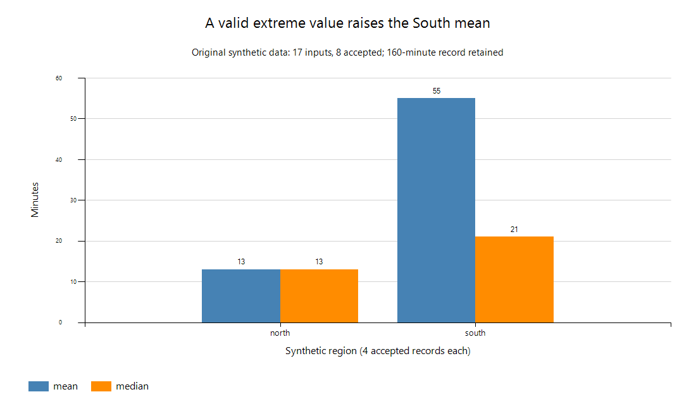

# PCED-30-02 Certified Entry-Level Data Analyst with Python Study Guide

> **Independent AI-assisted resource — SOURCES + OBJECTIVES CHECKED; HUMAN REVIEW PENDING.** Validate this guide against the [official PCED syllabus](https://pythoninstitute.org/pced-exam-syllabus), checked September 29, 2026.

**Current baseline:** PCED-30-02, active since July 15, 2025; syllabus last updated July 14, 2025; PCED-30-01 retired July 14, 2025<br>
**Upcoming blueprint change:** none announced on the live credential or syllabus pages<br>
**Official delivery snapshot:** 40 questions; 60 minutes plus NDA; 75%; single-/multiple-select and scenarios; TestNow; English and Spanish<br>
**Credential snapshot:** no formal prerequisite; PCEP-equivalent Python plus basic mathematics/statistics recommended; seven-year validity; exam from USD 69 when checked; seven-day wait after a failed attempt<br>

The active version is **30-02**. The exam page says already-issued 30-01 vouchers may still be redeemed despite that version's retirement; verify the code attached to a voucher. The current syllabus gives each item a maximum of one point and reports a normalized percentage. The four weights are not four separate passing thresholds. No official questions or current partial-credit rules were accessed.

Public practice instructions need clarification: the [standalone USD 29 kit](https://ums.edube.org/products/pced-practice-test) lists two tests with up to **10 launches each**, while the [USD 95 exam/retake/practice bundle](https://ums.edube.org/products/0-pi-pced-3002-erpt) says **five launches each**. The store says Test Candidate → Practice; the credential FAQ says Learner. These may be product or instruction differences; do not transfer one product's entitlement to another. Public voucher validity is 12 months. No purchase, redemption, enrolled assessment or account inspection was performed.

## How to use this guide

Use one small, auditable dataset from collection through reporting. Keep the raw input immutable, record each transformation, validate assumptions, and reproduce every reported number from code. At this level, sound reasoning and clean Python matter more than tool breadth.

> **About related items:** A `Related item:` callout adds useful adjacent context, not an additional published objective.

## Weighted objective map

| Block | Items | Weight | Evidence of readiness |
|---|---:|---:|---|
| Data and analysis concepts | 9 | 22.5% | Classify data/source/storage/lifecycle choices and identify ethical risks |
| Python basics for analysis | 13 | 32.5% | Manipulate core collections, functions, flow, exceptions, modules, and NumPy |
| Working with and analyzing data | 13 | 32.5% | Read, clean, validate, summarize, filter, correlate, and inspect outliers |
| Communicating insights | 5 | 12.5% | Select/interpret visuals and produce an audience-aware evidence narrative |

## 1. Data and data-analysis concepts — 22.5%

Data are recorded observations; information is data organized with context; knowledge is interpretation usable for action. Quantitative data represent amounts or counts; qualitative data represent categories or qualities. Structured data follows an explicit schema, semi-structured data carries flexible structure such as JSON, and unstructured data lacks a simple tabular model.

Sources include surveys, interviews, observations, applications/logs, APIs, databases, web pages, and devices. Evaluate each for relevance, coverage, timeliness, accuracy, collection bias, consent, and permitted use. A large sample can still be systematically unrepresentative. An online survey may miss people without access; interviews give depth but require careful selection and interpretation; automated logs offer scale but record only instrumented events. Start with a question, population, measurement unit and inclusion window before choosing a convenient source. Web accessibility does not imply permission to scrape or republish.

CSV is portable tabular text but has weak type/schema semantics; JSON represents nested structures; spreadsheets mix data, formulas, and presentation; relational databases enforce tables/relationships and support queries. Warehouses integrate governed analytical data; lakes retain varied data at scale. Metadata describes meaning, origin, schema, units, lineage, and quality.

The lifecycle runs through collection, storage, processing, analysis, reporting, archiving, and deletion. A mistake early in the chain can invalidate every later calculation. Lifecycle management supports quality, security, retention, reproducibility, and compliance. At collection, capture units and consent/provenance; at storage, control access and retain the raw version; during processing, log rules and counts; during analysis, check denominators; in reports, identify uncertainty; in archives, retain metadata; at deletion, follow the applicable retention policy. Cloud storage increases capacity, but does not by itself supply data ownership, quality checks or lineage. Scheduled pipelines need validation, failure reporting and a way to reproduce prior outputs.

Analysis examines data for a question; analytics describes the broader systematic decision practice; data science often adds engineering and predictive modeling. Descriptive asks what happened, diagnostic why, predictive what may happen, and prescriptive what action to take. Reporting last month's median wait is descriptive. Comparing staffing and case mix to investigate long waits is diagnostic; predicting next month's demand is predictive; choosing a staffing schedule under cost constraints is prescriptive. A correlation alone does not finish the diagnostic task. An analyst might maintain a report, an analytics team might connect it to operational decisions, and a data scientist might evaluate a prediction model; job titles overlap and do not define a universal boundary.

Ethical handling requires purpose limitation, transparency, appropriate consent/lawful basis, minimization, privacy, fairness, security, and accountability. GDPR, HIPAA, and CCPA apply under different jurisdictions and contexts; knowing a name is not enough to determine applicability. Anonymization aims to prevent re-identification; encryption protects data under a key but does not anonymize it.

The [European Commission overview](https://commission.europa.eu/law/law-topic/data-protection/reform/rules-business-and-organisations/principles-gdpr/overview-principles/what-data-can-we-process-and-under-which-conditions_en) supports purpose, minimization, accuracy, retention and security principles. [HHS covered-entity guidance](https://www.hhs.gov/hipaa/for-professionals/covered-entities/index.html) and the [California CCPA overview](https://www.oag.ca.gov/privacy/ccpa) identify different legal contexts; only limited indexed excerpts of the latter two were readable here. Their full requirements and applicability to an organization were not reviewed. Removing names alone may leave identifying combinations of dates, locations and rare events. The worked example uses invented observations without real people or organizations.

## 2. Python basics for analysis — 32.5%

Track both value and type. `type()` reports the current type; `isinstance()` supports ancestry-aware checks. Lists are ordered/mutable, tuples ordered/immutable, sets unique/unordered collections, dictionaries key/value mappings, and strings immutable text sequences. Use comprehensions for readable transformations, sets for membership/uniqueness, and dictionaries for grouping/counting/lookup.

Functions create reusable analysis steps. Distinguish positional, keyword, and default arguments; return a result instead of relying on printing. Local names normally hide global names. Avoid mutable global analysis state because it damages reproducibility.

Use comparison and Boolean expressions for explicit validation/filtering. `if` selects paths; `for` traverses observations; `while` repeats until state changes. `break`, `continue`, and loop `else` alter trace flow. Catch specific, expected exceptions such as conversion or file errors and record enough context to diagnose rejected rows.

For lists, distinguish `append` from `insert`, removal by index with `pop` from removal by value with `remove`, and a new `sorted` list from in-place `sort`/`reverse` returning `None`. Practice `count`, `index`, slices and comprehensions. A tuple prevents replacing its element references, but a list stored inside a tuple remains mutable. Sets support `add`, `remove`, union, intersection and difference; they discard duplicates and do not provide a stable presentation order. Dictionaries preserve insertion order but later assignment to a repeated key replaces its value, which can hide conflicting observations if used as an unquestioned deduplication rule.

The workbook exercises string indexing/iteration and every named method: `startswith`, `endswith`, `find`, `capitalize`, `isdigit`, `isalpha`, `strip`, `lower`, `upper`, `replace`, `title`, `split` and `join`. `find` returns `-1` when absent. `isdigit` is not a guarantee that `int` accepts the text, and signs/decimal points do not satisfy it. `bool("False")` is true because that string is nonempty; parse textual booleans with an explicit accepted vocabulary. `strip(chars)` removes a set of end characters, not an exact prefix.

A function with no explicit return, including a `pass` placeholder, returns `None`. Defaults are evaluated when the function is defined; use `None` and create a fresh list inside the function when calls should not share it. Assignment normally creates a local binding; `global` declares that rebinding targets the module namespace. Reading a module constant does not need `global`. The isolated workbook example makes rebinding visible without introducing application-wide mutable state. A loop's `else` runs on normal exhaustion/false condition, not after `break`; a `continue` alone does not suppress it.

Standard modules in scope include `math`, `random`, `statistics`, `collections`, `os`, `datetime`, and `csv`. NumPy is third-party: understand the interpreter-specific installation form `python -m pip install numpy`, then import it as `np`. This review used the existing NumPy 2.5.2 and CPython 3.13.14 without installing or updating anything. A standard-library module, a built-in function and an external package are distinct categories. Arrays have a shape, number of dimensions, size and dtype; choose a numeric dtype deliberately. Basic slicing can share memory, while copying a numeric array gives independent storage. A mean with `axis=0` aggregates down rows into a value per column; `axis=1` aggregates across columns. The default aggregates all values. Do not silently mix missing sentinels, strings, and numeric values.

## 3. Working with data and simple analyses — 32.5%

Use `with open(..., encoding="utf-8")` for text. The `csv` module handles quoting/newlines that manual splitting does not. Preserve raw data; write cleaned output separately. Check path existence only when it improves the workflow—existence can change between check and open, so still handle open failures.

Cleaning is a declared policy, not “make the errors disappear.” Identify missingness, invalid types/ranges, duplicates, inconsistent case/whitespace, and date/number formats. Record how many rows each rule changes or removes. Preserve zero as a possible valid measurement; missing is not automatically zero. Successful `float()` conversion also accepts `nan` and infinity, so check finiteness before calculations. A missing value can be removed or imputed under a justified, documented policy, but either choice can bias results. Validate date meaning as well as text shape, and retain units. The worked example uses an exact date round-trip and excludes invalid records without imputing values. Min-max normalization maps values relative to observed min/max and needs a policy when the range is zero.

Use `len`, `sum`, `min`, `max`, and `round`; `statistics.mean`, `median`, and `stdev`; `Counter` for frequencies; and NumPy arrays with `mean`, `median`, `std`, `sum`, `arange`, and `linspace`. Be explicit about population versus sample standard-deviation conventions: similarly named functions can use different default denominators. `statistics.pstdev` and `np.std(..., ddof=0)` divide squared deviations by N; `statistics.stdev` and `np.std(..., ddof=1)` use N−1 and require at least two values for a meaningful sample spread. The N−1 correction makes sample *variance* unbiased under the usual sampling assumptions; it does not make the standard deviation unbiased or make a biased sample representative. The workbook treats the accepted fixture as its complete observed population and also shows the sample convention for comparison.

An empty sum can be zero, but an empty mean is undefined. Return an explicit missing result for a filtered group with no observations; do not manufacture a zero mean. A singleton population standard deviation is zero; sample standard deviation is undefined. Normal NumPy statistics do not silently remove NaNs. Round for presentation after calculation, and remember that binary floats and ties-to-even rounding can surprise. `arange(start, stop, step)` excludes the stop; for a fixed count over an interval use `linspace`, whose endpoint is included by default. Floating steps in `arange` can accumulate representation error.

EDA uses sorting, filtering, unique/frequency counts, correlation, and outlier review to discover questions and data problems. Correlation from `numpy.corrcoef()` measures linear association, not causation. A standard-deviation rule can flag candidates, but domain context determines whether a value is error, rare reality, or important signal. Paired values must describe the same observations; constant columns cannot define Pearson correlation. Zero linear correlation can coexist with a strong nonlinear relationship, as the symmetric square example shows. The two-standard-deviation threshold below is a declared exploratory rule, not a universal test or a claim that the data are normally distributed. Compute a labeled sensitivity result without changing the primary accepted dataset.

> **Related item:** Fit transformations and thresholds on training data when building predictive systems; otherwise test information can leak into preparation. Formal ML workflows are beyond PCED but the habit prevents optimistic results.

## 4. Communicating insights — 12.5%

Use a line chart for ordered/time change, a bar chart for category comparison, and a pie chart only for a small part-to-whole view where angle comparison remains clear. Titles state the question or conclusion; axes, units, scales, labels, color, and source make the evidence interpretable. Truncated axes, inconsistent intervals, excessive categories, and decorative effects can mislead.

A concise narrative leads with the question and answer, shows the strongest evidence, acknowledges limitation/uncertainty, and closes with a proportionate recommendation. Adapt vocabulary and depth to the audience without changing facts. When challenged, trace a claim to the visual, metric, transformation, and source.

## Original executable workbook

Save the Python block as `analysis.py` and run `python -B -Werror analysis.py` in an environment already containing NumPy. The same file passed normally and with `-O`: **112 checks per run**, including expected errors. Checks use explicit exceptions, so optimization does not remove them. The original fixture creates 17 logical CSV records; a quoted field includes a comma, quote and newline. Record numbers are logical records, not physical line numbers.

| Field | Meaning and validation policy |
|---|---|
| `id` | Invented request identifier; trim whitespace; reject empty IDs |
| `date` | Synthetic observation date; valid calendar date and exact YYYY-MM-DD round-trip |
| `region` | Synthetic north/south category, normalized by stripping and lowercasing |
| `minutes` | Nonnegative finite measurement; missing/invalid values rejected, zero allowed |
| `depth` | Invented nonnegative integer covariate, not an independently collected cause |
| `note` | Original text retained exactly, including quoted multiline content |

Validation happens before duplicate handling. Among valid records, identical normalized records retain the first occurrence; **all valid records for a conflicting ID are excluded**, including conflicts in the note field. Invalid rows keep their validation disposition and do not participate in conflict detection. A different policy may suit real data, but it must be explicit. Reversing this fixture changes record positions while preserving accepted IDs. The ledger assigns one final disposition per input record, and the program verifies that raw bytes remain unchanged.

| Final disposition | Records |
|---|---:|
| Accepted | 8 |
| Identical duplicate | 1 |
| Missing minutes | 1 |
| Nonfinite minutes | 2 |
| Negative/range failure | 1 |
| Invalid date | 1 |
| Invalid numeric text | 1 |
| Conflicting ID | 2 |
| **Total** | **17** |

The program separately probes malformed CSV, wrong row width, an unknown category, noncanonical dates, empty input, missing files, constant scaling, undefined correlation and undersized sample statistics. Manual `strip().split(',')` is included for the restricted unquoted exercise in objective 3.1.2; the next check demonstrates why it cannot parse general CSV. The `csv` module uses `newline=""` and explicit UTF-8. `os.path.exists` is informative, not a promise that a later open will succeed.

### analysis.py

```python
"""Original PCED fixture with explicit cleaning and numerical checks."""

import csv
import hashlib
import io
import json
import math
import os
import operator
import random
import statistics as stats
import tempfile
from collections import Counter
from datetime import datetime
from pathlib import Path

import numpy as np


class Checks:
    """Keep checks active under python -O as well as normal execution."""

    def __init__(self):
        self.count = 0

    def equal(self, actual, expected):
        if actual != expected:
            raise AssertionError((actual, expected))
        self.count += 1

    def close(self, actual, expected):
        if not math.isclose(actual, expected, rel_tol=1e-12, abs_tol=1e-12):
            raise AssertionError((actual, expected))
        self.count += 1

    def raises(self, error, operation):
        try:
            operation()
        except error:
            self.count += 1
        else:
            raise AssertionError(f"Expected {error.__name__}")


def language(c):
    """Exercise the explicitly named beginner operations on original values."""
    c.equal((type(4).__name__, type(4.0).__name__), ("int", "float"))
    c.equal((isinstance(True, int), type(True) is int), (True, False))
    c.equal((7 + 3, 7 - 3, 7 / 2, 7 // 2, 7 % 2), (10, 4, 3.5, 3, 1))
    c.equal("ab" * 2 + "c", "ababc")
    values = [7, 2, 7]
    values.append(4)
    values.insert(1, 9)
    c.equal(values.pop(), 4)
    values.remove(7)
    c.equal(values, [9, 2, 7])
    c.equal(values.sort(), None)
    c.equal(values, [2, 7, 9])
    values.reverse()
    c.equal(
        (values[0], values[1:], values.count(7), values.index(2)),
        (9, [7, 2], 1, 2),
    )
    c.equal([x * 2 for x in values if x > 2], [18, 14])
    c.raises(ValueError, lambda: values.remove(88))
    c.raises(IndexError, lambda: values[99])
    pair = ("north", 4)
    c.equal(pair[1], 4)
    c.raises(TypeError, lambda: operator.setitem(pair, 0, "south"))
    # An immutable tuple can contain a mutable object.
    nested = ([1],)
    nested[0].append(2)
    c.equal(nested, ([1, 2],))
    unique = {1, 2, 2}
    unique.add(3)
    unique.remove(1)
    c.equal(
        (
            unique.union({4}),
            unique.intersection({3, 4}),
            unique.difference({3}),
        ),
        ({2, 3, 4}, {3}, {2}),
    )
    c.equal((3 in unique, len(unique)), (True, 2))
    c.raises(KeyError, lambda: unique.remove(99))
    lookup = {"north": 2, "south": 3}
    lookup["north"] += 1
    del lookup["south"]
    c.equal(list(lookup.items()), [("north", 3)])
    c.equal(lookup.get("missing", 0), 0)
    word = "Report.csv"
    c.equal(
        (word[0], word[1:4], "".join(ch for ch in word)), ("R", "epo", word)
    )
    c.equal(
        (
            word.startswith("Rep"),
            word.endswith("csv"),
            word.find("."),
            word.find("!"),
        ),
        (True, True, 6, -1),
    )
    c.equal(
        ("nORTH".capitalize(), "12".isdigit(), "North".isalpha()),
        ("North", True, True),
    )
    c.equal("  north-zone ".strip().replace("-", " ").title(), "North Zone")
    c.equal(("North".upper(), "North".lower()), ("NORTH", "north"))
    c.equal("|".join("a,b".split(",")), "a|b")
    c.equal(
        (int("12"), float("1.5"), str(12), bool("False")),
        (12, 1.5, "12", True),
    )
    c.raises(ValueError, lambda: int("1.5"))
    c.equal("\u00b2".isdigit(), True)
    c.raises(ValueError, lambda: int("\u00b2"))
    c.equal((round(2.5), round(3.5)), (2, 4))
    c.equal(f"{12.345:.2f}", "12.35")
    c.raises(TypeError, lambda: 1 + "2")

    def amount(value, multiplier=2):
        return value * multiplier

    def placeholder():
        pass

    label = "outer"

    def shadow():
        label = "local"
        return label

    c.equal((amount(4), amount(value=4, multiplier=3)), (8, 12))
    c.equal(placeholder(), None)
    c.equal((shadow(), label), ("local", "outer"))
    # A separate namespace makes global rebinding visible without app state.
    namespace = {"counter": 0}
    exec("def increment():\n global counter\n counter += 1", namespace)
    namespace["increment"]()
    c.equal(namespace["counter"], 1)
    trace = []
    for value in [0, 2, 4, 6]:
        if value == 0:
            continue
        elif value > 4:
            break
        else:
            if value % 2 == 0:
                trace.append(value)
    else:
        trace.append("exhausted")
    c.equal(trace, [2, 4])
    remaining = 2
    while remaining:
        remaining -= 1
    else:
        trace.append("finished")
    c.equal(trace, [2, 4, "finished"])
    c.equal(not (3 < 2) and 1 <= 2 < 3 or False, True)
    c.equal((math.sqrt(81), math.ceil(-1.2), math.floor(-1.2)), (9, -1, -2))
    global_state = random.getstate()
    sample = random.Random(29).sample(range(8), 3)
    c.equal(sample, random.Random(29).sample(range(8), 3))
    c.equal((len(sample), len(set(sample))), (3, 3))
    c.equal(random.getstate(), global_state)
    c.raises(ValueError, lambda: random.Random(29).sample([1], 2))
    a = np.array([[1, 3], [5, 7]], dtype=float)
    c.equal((a.shape, a.ndim, a.size), ((2, 2), 2, 4))
    c.equal(np.mean(a, axis=0).tolist(), [3, 5])
    c.equal(np.sum(a, axis=1).tolist(), [4, 12])
    view = a[:, 0]
    view[0] = 9
    c.equal(a[0, 0], 9)
    independent = a.copy()
    independent[0, 0] = 99
    c.equal(a[0, 0], 9)
    c.equal(np.arange(1, 8, 2).tolist(), [1, 3, 5, 7])
    c.equal(np.linspace(0, 1, 5).tolist(), [0, 0.25, 0.5, 0.75, 1])
    c.equal(np.sort([3, 1, 2]).tolist(), [1, 2, 3])
    c.equal(np.unique([3, 1, 3], return_counts=True)[1].tolist(), [1, 2])
    c.equal(
        np.isfinite([1, float("nan"), float("inf")]).tolist(),
        [True, False, False],
    )
    c.equal(np.sum([]), 0)
    c.raises(stats.StatisticsError, lambda: stats.mean([]))
    c.raises(stats.StatisticsError, lambda: stats.stdev([3]))
    c.equal(stats.pstdev([3]), 0)
    c.close(float(np.corrcoef([-2, -1, 0, 1, 2], [4, 1, 0, 1, 4])[0, 1]), 0)


HEADER = ["id", "date", "region", "minutes", "depth", "note"]
DURATIONS = [10, 12, 14, 16, 18, 20, 22, 160]


def fixture():
    """Build original observations and deliberate data-quality failures."""
    rows = [
        [
            f"R{i:02}",
            f"2026-09-{i:02}",
            " NORTH " if i <= 4 else "south",
            str(value),
            str(i),
            'quoted, "note"\nsecond line' if i == 1 else "original",
        ]
        for i, value in enumerate(DURATIONS, 1)
    ]
    rows += [rows[1].copy()]  # Identical duplicate; retain first record.
    for ident, value, date in [
        ("MISSING", "", "2026-09-09"),
        ("NAN", "nan", "2026-09-09"),
        ("INF", "inf", "2026-09-09"),
        ("NEG", "-1", "2026-09-09"),
        ("DATE", "30", "2026-02-30"),
        ("TEXT", "soon", "2026-09-09"),
        ("CONFLICT", "30", "2026-09-09"),
        ("CONFLICT", "31", "2026-09-09"),
    ]:
        rows.append([ident, date, "north", value, "9", "original"])
    return rows


def clean(rows):
    """One final disposition per record; reject all conflicting valid IDs."""
    staged, ledger, by_id = [], [], {}
    for number, fields in enumerate(rows, 1):
        status, row = "accepted", None
        try:
            if len(fields) != len(HEADER):
                raise ValueError("width")
            ident, date, region, minutes, depth, note = fields
            region = region.strip().lower()
            if not ident.strip() or region not in {"north", "south"}:
                raise ValueError("category_or_id")
            if not minutes.strip():
                raise ValueError("missing_minutes")
            try:
                minutes = float(minutes)
                depth = int(depth)
            except ValueError:
                raise ValueError("numeric_format") from None
            if not math.isfinite(minutes):
                raise ValueError("nonfinite_minutes")
            if minutes < 0 or depth < 0:
                raise ValueError("range")
            try:
                day = datetime.strptime(date, "%Y-%m-%d")
                if day.strftime("%Y-%m-%d") != date:
                    raise ValueError
            except ValueError:
                raise ValueError("date") from None
            row = (ident.strip(), date, region, minutes, depth, note)
            by_id.setdefault(row[0], set()).add(row)
        except ValueError as error:
            status = str(error)
        staged.append(row)
        ledger.append({"record": number, "status": status})
    kept, seen = [], set()
    for row, entry in zip(staged, ledger):
        if row is None:
            continue
        if len(by_id[row[0]]) > 1:
            entry["status"] = "conflicting_id"
        elif row in seen:
            entry["status"] = "duplicate"
        else:
            seen.add(row)
            kept.append(dict(zip(HEADER, row)))
    return kept, ledger


def scale(values):
    """Empty stays empty; constant finite columns map to zero by policy."""
    if not values:
        return []
    if not all(math.isfinite(x) for x in values):
        raise ValueError("finite values required")
    low, high = min(values), max(values)
    return [0.0 if high == low else (x - low) / (high - low) for x in values]


def correlation(x, y):
    """Return None when paired finite data cannot define Pearson r."""
    if len(x) != len(y):
        raise ValueError("paired lengths differ")
    if len(x) < 2 or not all(math.isfinite(v) for v in [*x, *y]):
        return None
    if min(x) == max(x) or min(y) == max(y):
        return None
    return float(np.corrcoef(x, y)[0, 1])


def pipeline(c):
    """Use disposable files; return the reproducible report for inspection."""
    with tempfile.TemporaryDirectory(
        prefix="pced-", dir=Path(__file__).parent
    ) as tmp:
        folder = Path(tmp).resolve()
        c.equal(folder.parent, Path(__file__).resolve().parent)
        path = folder / "raw.csv"
        with open(path, "w", encoding="utf-8", newline="") as stream:
            writer = csv.writer(stream)
            writer.writerow(HEADER)
            writer.writerows(fixture())
        digest = hashlib.sha256(path.read_bytes()).hexdigest()
        c.equal(os.path.exists(path), True)
        with open(path, encoding="utf-8", newline="") as stream:
            reader = csv.reader(stream, strict=True)
            c.equal(next(reader), HEADER)
            raw = list(reader)
        c.equal(len(raw), 17)
        c.equal(raw[0][-1], 'quoted, "note"\nsecond line')
        c.equal(" a,b \n".strip().split(","), ["a", "b"])
        quoted = 'a,"b,c"\n'
        c.equal(len(quoted.strip().split(",")), 3)
        c.equal(next(csv.reader(io.StringIO(quoted))), ["a", "b,c"])
        c.raises(
            csv.Error,
            lambda: list(csv.reader(io.StringIO('"bad'), strict=True)),
        )
        c.raises(FileNotFoundError, lambda: (folder / "absent").read_text())
        rows, ledger = clean(raw)
        counts = dict(Counter(item["status"] for item in ledger))
        c.equal(
            counts,
            {
                "accepted": 8,
                "duplicate": 1,
                "missing_minutes": 1,
                "nonfinite_minutes": 2,
                "range": 1,
                "date": 1,
                "numeric_format": 1,
                "conflicting_id": 2,
            },
        )
        c.equal(sum(counts.values()), len(raw))
        c.equal(
            sorted(row["id"] for row in clean(list(reversed(raw)))[0]),
            sorted(row["id"] for row in rows),
        )
        c.equal(clean([["short"]])[1][0]["status"], "width")
        c.equal(clean([]), ([], []))
        invalid = raw[0].copy()
        invalid[2] = "west"
        c.equal(clean([invalid])[1][0]["status"], "category_or_id")
        invalid = raw[0].copy()
        invalid[1] = "2026-9-01"
        c.equal(clean([invalid])[1][0]["status"], "date")
        values = [row["minutes"] for row in rows]
        c.equal(values, DURATIONS)
        a = np.array(values, dtype=np.float64)
        c.close(stats.mean(values), 34)
        c.close(stats.median(values), 17)
        c.close(float(np.mean(a)), stats.mean(values))
        c.close(float(np.median(a)), stats.median(values))
        c.close(float(np.sum(a)), sum(values))
        c.close(float(np.std(a)), stats.pstdev(values))
        c.close(float(np.std(a, ddof=1)), stats.stdev(values))
        c.close(stats.variance(values), stats.pvariance(values) * 8 / 7)
        c.equal(
            (len(values), min(values), max(values), sum(values)),
            (8, 10, 160, 272),
        )
        c.equal(scale([]), [])
        c.equal(scale([4, 4]), [0, 0])
        c.equal((scale(values)[0], scale(values)[-1]), (0, 1))
        c.raises(ValueError, lambda: scale([float("nan")]))
        groups = {}
        for row in rows:
            groups.setdefault(row["region"], []).append(row["minutes"])
        summary = {
            key: {
                "count": len(items),
                "mean": stats.mean(items),
                "median": stats.median(items),
            }
            for key, items in groups.items()
        }
        c.equal(
            summary,
            {
                "north": {"count": 4, "mean": 13, "median": 13},
                "south": {"count": 4, "mean": 55, "median": 21},
            },
        )
        c.equal(
            [
                r["id"]
                for r in rows
                if r["region"] == "south" and r["minutes"] < 21
            ],
            ["R05", "R06"],
        )
        empty = [x for x in values if x < 0]
        c.equal(stats.mean(empty) if empty else None, None)
        c.equal(list(filter(lambda x: x < 15, values)), [10, 12, 14])
        c.equal(sorted(values, reverse=True)[0], 160)
        c.equal(len(set(r["region"] for r in rows)), 2)
        candidate_mask = np.abs(a - np.mean(a)) > 2 * np.std(a)
        flagged = [r["id"] for r, flag in zip(rows, candidate_mask) if flag]
        c.equal(flagged, ["R08"])
        c.equal(a[candidate_mask].tolist(), [160])
        c.close(float(np.mean(a[~candidate_mask])), 16)
        c.equal(len(rows), 8)  # Flagging has not removed the observation.
        c.equal(correlation([1, 1], [2, 3]), None)
        c.equal(correlation([], []), None)
        c.equal(correlation([1, float("nan")], [2, 3]), None)
        c.raises(ValueError, lambda: correlation([1], [2, 3]))
        c.close(correlation([1, 2, 3], [2, 4, 6]), 1)
        c.close(correlation([1, 2, 3], [6, 4, 2]), -1)
        report = {
            "source": "Original synthetic fixture; no real people or services",
            "created_on": "2026-09-29",
            "license": "Repository license",
            "raw_sha256": digest,
            "input_records": len(raw),
            "ledger": ledger,
            "dispositions": counts,
            "groups": summary,
            "count": len(values),
            "mean_minutes": stats.mean(values),
            "median_minutes": stats.median(values),
            "population_sd": stats.pstdev(values),
            "sample_sd": stats.stdev(values),
            "flagged_ids": flagged,
            "sensitivity_mean_without_flag": float(
                np.mean(a[~candidate_mask])
            ),
            "depth_minutes_r": correlation([r["depth"] for r in rows], values),
        }
        output = folder / "report.json"
        with open(output, "w", encoding="utf-8") as stream:
            stream.write(json.dumps(report, indent=2, allow_nan=False) + "\n")
        with open(output, encoding="utf-8") as stream:
            c.equal(json.loads(stream.read()), report)
        with open(output, encoding="utf-8") as stream:
            c.equal(len(stream.readlines()) > 1, True)
        cleaned = folder / "clean.csv"
        with open(cleaned, "w", encoding="utf-8", newline="") as stream:
            writer = csv.DictWriter(stream, fieldnames=HEADER)
            writer.writeheader()
            writer.writerows(rows)
        with open(cleaned, encoding="utf-8", newline="") as stream:
            c.equal(list(csv.DictReader(stream))[0]["note"], rows[0]["note"])
        c.equal(hashlib.sha256(path.read_bytes()).hexdigest(), digest)
    c.equal(folder.exists(), False)
    return report


if __name__ == "__main__":
    checks = Checks()
    language(checks)
    result = pipeline(checks)
    print(json.dumps(result, indent=2, allow_nan=False))
    print(f"PCED: {checks.count} checks; temporary files removed")
```

### Observed report and chart

The eight accepted durations are **10, 12, 14, 16, 18, 20, 22 and 160 minutes**. Their sum is 272, mean 34 and median 17. Population standard deviation is approximately 47.770284; the sample convention gives 51.068581. North has four observations with mean/median 13/13; South has four with mean/median 55/21. The two-standard-deviation rule flags R08 but retains it. Excluding it only for sensitivity gives a mean of 16 across seven records. The assigned depth variable has Pearson r approximately 0.639529 with duration; the construction of this fixture supplies no causal evidence.

| Synthetic category | Count | Mean minutes | Median minutes |
|---|---:|---:|---:|
| North | 4 | 13 | 13 |
| South | 4 | 55 | 21 |



The chart was exported from the computed report using the existing Windows .NET chart component; no plotting package was installed. Labels and an accompanying table provide the values without depending solely on color. A line joining North and South would suggest an order or continuity they do not have; a pie chart of means would imply an invalid part-to-whole interpretation. A truncated bar axis would exaggerate the difference.

**Five-sentence narrative:** In this synthetic fixture, the South mean is higher than the North mean. Each category contains four accepted observations, with means of 55 and 13 minutes respectively. South's median is 21 minutes, and its valid 160-minute record explains the large separation between its mean and median. The fixture is small, invented and selected for teaching, so it estimates neither real service performance nor a causal effect of region. Investigate the provenance and case context of unusual records before changing any operational policy.

For an executive audience, lead with that limitation and the mean/median comparison. For an analyst, show the raw hash, ledger, accepted IDs, formulas, `ddof` and sensitivity rule. If asked why the extreme record stayed, trace R08 to a valid finite source observation and distinguish a statistical flag from a proven error. This is a completed bounded synthetic demonstration; the broader public-dataset lab below remains a learner activity.

### chart.ps1

On Windows with the chart assembly already available, save the script below and supply the JSON part of the Python output as `report.json` (exclude the final check-count line). Run `powershell -NoProfile -File chart.ps1 -ReportPath report.json -OutputPath chart.png`. It saves a PNG without opening a window. This optional presentation helper is outside the Python exam objectives and is not a claim of portability to other operating systems.

```powershell
param([Parameter(Mandatory=$true)][string]$ReportPath,
      [Parameter(Mandatory=$true)][string]$OutputPath)
$ErrorActionPreference = 'Stop'
Add-Type -AssemblyName System.Windows.Forms.DataVisualization
$report = Get-Content -LiteralPath $ReportPath -Raw | ConvertFrom-Json
$chart = New-Object System.Windows.Forms.DataVisualization.Charting.Chart
try {
    $chart.Width = 1100
    $chart.Height = 650
    $chart.BackColor = [System.Drawing.Color]::White
    $chart.Font = New-Object System.Drawing.Font('Segoe UI', 12)
    $area = New-Object System.Windows.Forms.DataVisualization.Charting.ChartArea
    $area.AxisY.Minimum = 0
    $area.AxisY.Maximum = 60
    $area.AxisY.Interval = 10
    foreach ($tick in 0,10,20,30,40,50,60) {
        [void]$area.AxisY.CustomLabels.Add(($tick - 0.5), ($tick + 0.5), [string]$tick)
    }
    $area.AxisY.Title = 'Minutes'
    $area.AxisY.LabelStyle.Format = '0;0'
    $area.AxisY.LabelStyle.Font = New-Object System.Drawing.Font('Segoe UI', 12)
    $area.AxisX.LabelStyle.Font = New-Object System.Drawing.Font('Segoe UI', 12)
    $area.AxisY.TitleFont = New-Object System.Drawing.Font('Segoe UI', 12)
    $area.AxisX.TitleFont = New-Object System.Drawing.Font('Segoe UI', 12)
    $area.AxisX.Title = 'Synthetic region (4 accepted records each)'
    $area.AxisX.MajorGrid.Enabled = $false
    $area.AxisY.MajorGrid.LineColor = [System.Drawing.Color]::LightGray
    $chart.ChartAreas.Add($area)
    $legend = New-Object System.Windows.Forms.DataVisualization.Charting.Legend
    $legend.Docking = 'Bottom'
    $legend.Font = New-Object System.Drawing.Font('Segoe UI', 12)
    $chart.Legends.Add($legend)
    foreach ($metric in @('mean', 'median')) {
        $series = New-Object System.Windows.Forms.DataVisualization.Charting.Series($metric)
        $series.ChartType = 'Column'
        $series.IsValueShownAsLabel = $true
        $series.Color = if ($metric -eq 'mean') { [System.Drawing.Color]::SteelBlue } else { [System.Drawing.Color]::DarkOrange }
        foreach ($region in @('north', 'south')) {
            $value = [double]$report.groups.$region.$metric
            [void]$series.Points.AddXY($region, $value)
        }
        $chart.Series.Add($series)
    }
    [void]$chart.Titles.Add('A valid extreme value raises the South mean')
    $chart.Titles[0].Font = New-Object System.Drawing.Font('Segoe UI', 17)
    $subtitle = $chart.Titles.Add('Original synthetic data: 17 inputs, 8 accepted; 160-minute record retained')
    $subtitle.Font = New-Object System.Drawing.Font('Segoe UI', 11)
    $chart.SaveImage($OutputPath, [System.Windows.Forms.DataVisualization.Charting.ChartImageFormat]::Png)
    Write-Output 'Saved 1100x650 PNG; zero-based scale; four values from report JSON.'
} finally {
    $chart.Dispose()
}
```

## Integrated lab

Analyze a public, non-sensitive CSV of service requests:

1. write a one-paragraph question and data dictionary;
2. preserve raw input and log source/date/license;
3. validate required fields, parse dates/numbers, and count rejected rows;
4. normalize categories, handle missing values under a stated rule, and de-duplicate by a defensible key;
5. compute grouped counts, mean/median/spread, conditional metrics, unique values, candidate outliers, and one correlation;
6. reproduce a selected metric with both built-ins and NumPy;
7. create a bar or line chart and a five-sentence evidence narrative;
8. document limitations, ethical risks, and what would change your conclusion.

## Original knowledge checks

1. Distinguish data, information, and knowledge.
2. Why can a large sample remain biased?
3. Compare CSV, JSON, database, warehouse, and lake.
4. How can a collection error affect the lifecycle?
5. Match descriptive, diagnostic, predictive, and prescriptive questions.
6. Why is encryption not anonymization?
7. When is a set preferable to a list?
8. Why should an analysis function return rather than only print?
9. Why catch specific exceptions while ingesting rows?
10. Why is manual comma splitting unsafe for CSV?
11. What policy is needed for a constant column under min-max scaling?
12. Why can standard-deviation results differ across libraries?
13. What does correlation not establish?
14. Why should an outlier not be deleted automatically?
15. What makes a chart misleading?
16. What chain should support every reported claim?

## Answers and reasoning

1. A duration of 20 minutes is a recorded observation. A dated regional median with units gives information. Deciding what further investigation it supports requires knowledge of the service and its constraints; arithmetic alone does not justify an action.
2. Ten thousand responses from a convenience channel may omit a whole population group. More observations do not repair a systematically biased sampling frame, nonresponse or faulty measurement.
3. CSV exchanges rows but needs external type/unit definitions; JSON represents nested fields; a relational database supports constraints and queries. A warehouse integrates data for analysis, while a lake can retain diverse source forms. Choose by structure, scale and access needs rather than treating one as universally superior.
4. If collection records seconds as minutes, later means and charts can be internally consistent yet wrong. Preserve metadata and validate units early; transformation logs make the error traceable but do not automatically repair it.
5. Last month's median is descriptive; investigating workload and staffing is diagnostic; forecasting arrivals is predictive; choosing a feasible staffing schedule is prescriptive. A diagnostic hypothesis still needs evidence beyond correlation.
6. Encryption can restore the original identifying data to someone with the key. Anonymization concerns whether people can be identified from the remaining data and context; dropping a name column alone may be insufficient.
7. Use a set for membership and unique categories when duplicates and presentation order are irrelevant. Do not use it to erase evidence of duplicate or conflicting request IDs before recording that evidence.
8. A returned result can feed a chart, test or report independently of display. A function that only prints normally returns `None`, making further numeric use fail or require reparsing text.
9. An invalid numeric field warrants a recorded row rejection; a missing file warrants an input failure; a programmer's unexpected exception needs investigation. Catching everything and continuing can silently produce an incomplete or false report.
10. A quoted comma belongs inside one field, and a quoted newline belongs inside one logical record. `split(',')` and line-by-line assumptions lose that structure; use the CSV parser for general CSV.
11. The denominator max−min is zero. This workbook maps a constant finite column to zeros and an empty input to an empty output; another declared policy could retain or exclude the column. Neither choice invents variation.
12. `np.std` defaults to N, while `statistics.stdev` uses N−1. Match `ddof`, accepted observations and missing-value policy before comparing. The sample correction addresses variance estimation under assumptions, not sampling bias.
13. Pearson correlation does not prove causality, rule out confounding or detect every nonlinear relationship. It is undefined for a constant input; paired observations and finite values are prerequisites for this workbook's calculation.
14. R08 is finite and passes the fixture's declared validation rules. Its large value changes the mean but is not evidence of error. Retain it in the main result and label the seven-record sensitivity calculation separately.
15. A bar chart with a cropped baseline can exaggerate category differences; joining unordered regions implies continuity; a pie of means has no meaningful whole. State counts, units and source, and supply readable labels and a table.
16. Start with source/version and raw hash, then row dispositions, accepted data, formula/denominator, output table/chart and the exact claim. A reader should be able to reproduce the number and see why its scope is limited.

## Readiness checklist

- [ ] I can classify sources, formats, lifecycle stages, analytics types, and ethical risks from a scenario.
- [ ] I can use every listed Python collection, flow construct, function/error concept, standard module, and NumPy operation.
- [ ] I preserve raw data and make cleaning/validation decisions explicit and countable.
- [ ] I can calculate and interpret aggregates, descriptive statistics, conditional metrics, frequencies, correlation, and candidate outliers.
- [ ] I can select and critique a visual and produce an evidence-backed audience-aware report.
- [ ] I reproduced and explained the synthetic workbook, then completed the separate public-dataset lab with original code and data.

## Source and freshness notes

- [Official PCED syllabus](https://pythoninstitute.org/pced-exam-syllabus): all 40 numbered objectives, four weights and the MQC profile manually read through the indexed primary page after direct retrieval and the objective monitor timed out. The existing snapshot was retained; no successful automated hash observation is claimed.
- [Official PCED page](https://pythoninstitute.org/pced): active code, delivery, price, languages, seven-year validity and failed-retake rule. [TestNow policy](https://pythoninstitute.org/pced-testing-policies): selected public delivery, environment and conduct sections; the entire policy and an actual account/system test were not reviewed.
- [Python documentation index](https://docs.python.org/3/) currently identifies 3.14.7, while selected 3.13 references identify 3.13.15. Execution used existing 3.13.14. There is no inferred exam patch-version requirement.
- Selected primary contracts: [types](https://docs.python.org/3.13/library/stdtypes.html), [built-ins](https://docs.python.org/3.13/library/functions.html), [control flow](https://docs.python.org/3.13/tutorial/controlflow.html), [CSV](https://docs.python.org/3.13/library/csv.html), [statistics](https://docs.python.org/3.13/library/statistics.html), [math](https://docs.python.org/3.13/library/math.html), [random](https://docs.python.org/3.13/library/random.html), [Counter](https://docs.python.org/3.13/library/collections.html), [dates](https://docs.python.org/3.13/library/datetime.html) and [path existence](https://docs.python.org/3.13/library/os.path.html). Per-source evidence records exactly which sections were read, rather than treating downloads as complete reviews.
- NumPy: [user index](https://numpy.org/doc/stable/user/) is navigation, [quickstart](https://numpy.org/doc/stable/user/quickstart.html) was read in selected sections; complete generated entries were read for [array](https://numpy.org/doc/stable/reference/generated/numpy.array.html), [mean](https://numpy.org/doc/stable/reference/generated/numpy.mean.html), [median](https://numpy.org/doc/stable/reference/generated/numpy.median.html), [std](https://numpy.org/doc/stable/reference/generated/numpy.std.html), [sum](https://numpy.org/doc/stable/reference/generated/numpy.sum.html), [arange](https://numpy.org/doc/stable/reference/generated/numpy.arange.html), [linspace](https://numpy.org/doc/stable/reference/generated/numpy.linspace.html), [corrcoef](https://numpy.org/doc/stable/reference/generated/numpy.corrcoef.html), [sort](https://numpy.org/doc/stable/reference/generated/numpy.sort.html), [unique](https://numpy.org/doc/stable/reference/generated/numpy.unique.html) and [isfinite](https://numpy.org/doc/stable/reference/generated/numpy.isfinite.html).
- The optional Windows helper uses [Microsoft Chart.SaveImage](https://learn.microsoft.com/en-us/dotnet/api/system.windows.forms.datavisualization.charting.chart.saveimage?view=netframework-4.8.1). The exported image was visually inspected by the AI reviewer, not by a human; a complete accessibility assessment remains pending.

## Places to learn

This is not a complete list. Choose one foundation path, reproduce the workbook, then use targeted references to close gaps. Author planning budgets below are not provider runtimes or evidence of course completion.

| Resource | Access | Estimated time |
|---|---|---|
| [PCED-30-02 syllabus](https://pythoninstitute.org/pced-exam-syllabus) | Official current objective checklist | Author budget: 2–3 hours |
| [PD101 public course outline](https://edube.org/study/pd101) | Associated with PCED; Core lessons/module tests free; no formal prerequisite; English | Provider: 5 weeks at about 1 hour/day |
| [PD101 Pro courseware](https://ums.edube.org/products/pi-pd101-courseware) | USD 49 public offer; interactive work, quizzes/labs/projects and diploma; minimum 12-month access after redemption; no enrolled interior inspected | Provider: same 5-week course outline; individual progress varies |
| [Vendor PD101 overview](https://pythoninstitute.org/python-for-data-analytics-101) | Partly readable indexed page; public Edube/store bodies provide the fuller observed details | Do not infer lesson completion or unrestricted free access to Pro features |
| [Standalone PCED practice kit](https://ums.edube.org/products/pced-practice-test) | USD 29, two tests, up to 10 launches each; practice only; current questions not inspected | Author remediation budget: 4–7 hours |
| [Exam/retake/practice bundle](https://ums.edube.org/products/0-pi-pced-3002-erpt) | USD 95; public practice limit says five launches each; confirm purchased entitlement | No measured exam-preparation duration |
| [NumPy quickstart](https://numpy.org/doc/stable/user/quickstart.html) | Free primary documentation; select arrays, aggregation, indexing and copies | Author budget: 4–8 hours |
| [Cisco Data Analytics Essentials](https://www.netacad.com/courses/data-analytics-essentials) | Response was a short application shell; current course contents/duration not verified | Verify current listing; prior 30-hour estimate removed |
| [Python for Data Analysis, 3rd ed.](https://wesmckinney.com/book/) | Complete landing read; open web edition, August 2022, updated for pandas 2.0/Python 3.10 in April 2023; broader than PCED; chapters not reviewed | Author selective-reading budget: 15–25 hours |
| [Kaggle Learn](https://www.kaggle.com/learn) | Retrieval failed; current Python/Pandas availability, contents and runtime unverified | No verified duration |

The book's text is not generally licensed for reproduction; its code examples have a separate MIT license. No material from it or paid practice questions was copied into this workbook. The store root returned only a shell; direct product pages supplied the practice evidence. Provider prices, access and redemption instructions are dated observations requiring confirmation when used.
